# 🧠 Herramientas Algorítmicas
### Material Principal de Estudio
> **Público:** Jóvenes de 15 años  
> **Duración:** 9 clases × 3 horas (con 15 min de descanso)  
> **Lenguaje de referencia:** Pseudocódigo + Python

---

## 📋 Tabla de Contenidos

| Clase | Tema | Horas |
|-------|------|-------|
| 1 | ¿Qué es un algoritmo? Pensamiento computacional | 3h |
| 2 | Variables, tipos de datos y operadores | 3h |
| 3 | Estructuras de decisión (if / else / elif) | 3h |
| 4 | Ciclos: while y for | 3h |
| 5 | Funciones y subprogramas | 3h |
| 6 | Arreglos (listas) — parte I | 3h |
| 7 | Arreglos (listas) — parte II + Matrices | 3h |
| 8 | Integración: algoritmos más complejos | 3h |
| 9 | Proyecto final + cierre del curso | 3h |

---

---

# 🟦 CLASE 1
## ¿Qué es un algoritmo? Pensamiento computacional

> **Duración:** 3 horas · Descanso a los 90 minutos

---

### 🎯 Objetivos de la clase
- Comprender qué es un algoritmo y para qué sirve.
- Identificar los pasos necesarios para resolver un problema usando un computador.
- Representar soluciones mediante diagramas de flujo y pseudocódigo.

---

### ⏱️ Distribución del tiempo

| Bloque | Actividad | Tiempo |
|--------|-----------|--------|
| 1 | Introducción y motivación | 20 min |
| 2 | Concepto de algoritmo | 30 min |
| 3 | Diagramas de flujo | 30 min |
| — | ☕ **DESCANSO** | 15 min |
| 4 | Pseudocódigo | 30 min |
| 5 | Ejemplos prácticos | 20 min |
| 6 | 🛠️ Taller individual | 35 min |

---

### 📖 Contenido

#### 1.1 ¿Qué es un problema computacional?

Un **problema computacional** es cualquier situación en la que necesitamos una respuesta a partir de cierta información. El computador puede ayudarnos si le damos instrucciones claras, precisas y en el orden correcto.

Antes de escribir código, todo programador debe:
1. **Entender** el problema.
2. **Analizar** qué información tiene (entradas) y qué necesita obtener (salidas).
3. **Diseñar** los pasos para pasar de la entrada a la salida.
4. **Codificar** esos pasos en un lenguaje de programación.
5. **Probar** que el resultado sea correcto.

> 💡 **Metáfora:** Un algoritmo es como una receta de cocina. Si quieres hacer un pastel, no puedes meter los ingredientes al horno antes de mezclarlos. El orden importa.

---

#### 1.2 ¿Qué es un algoritmo?

Un **algoritmo** es un conjunto de pasos ordenados, finitos y precisos que resuelven un problema.

Características de todo algoritmo:
- **Finito:** Tiene un inicio y un fin.
- **Preciso:** Cada paso es claro, no da lugar a ambigüedades.
- **Definido:** Si se repite el proceso con los mismos datos, el resultado siempre es el mismo.
- **Tiene entradas y salidas:** Recibe datos y produce resultados.

---

#### 1.3 Diagramas de flujo

Los **diagramas de flujo** son representaciones gráficas de un algoritmo. Usan símbolos estándar:

| Símbolo | Forma | Significado |
|---------|-------|-------------|
| Inicio / Fin | Óvalo | Punto de inicio o fin del algoritmo |
| Proceso | Rectángulo | Operación o cálculo |
| Decisión | Rombo | Pregunta con respuesta Sí/No |
| Entrada/Salida | Paralelogramo | Leer datos / Mostrar resultados |
| Flecha | → | Indica el flujo o dirección |

**Ejemplo:** Algoritmo para saber si un número es par o impar.

```
[INICIO]
    ↓
[Leer número N]
    ↓
¿N % 2 == 0? → SÍ → [Mostrar "Es par"]  → [FIN]
      ↓ NO
[Mostrar "Es impar"]
    ↓
[FIN]
```

---

#### 1.4 Pseudocódigo

El **pseudocódigo** es una forma de escribir algoritmos usando lenguaje natural mezclado con instrucciones similares a la programación. No tiene reglas fijas de sintaxis, pero sí debe ser claro.

**Ejemplo:** El mismo problema anterior en pseudocódigo:

```
INICIO
  Leer N
  SI N mod 2 == 0 ENTONCES
    Escribir "El número es par"
  SINO
    Escribir "El número es impar"
  FIN SI
FIN
```

**Ejemplo en Python:**
```python
N = int(input("Ingresa un número: "))
if N % 2 == 0:
    print("El número es par")
else:
    print("El número es impar")
```

**Ejemplo en C#:**
```csharp
Console.Write("Ingresa un número: ");
int N = int.Parse(Console.ReadLine());
if (N % 2 == 0) {
    Console.WriteLine("El número es par");
} else {
    Console.WriteLine("El número es impar");
}
```

**Diagrama de flujo (Mermaid):**
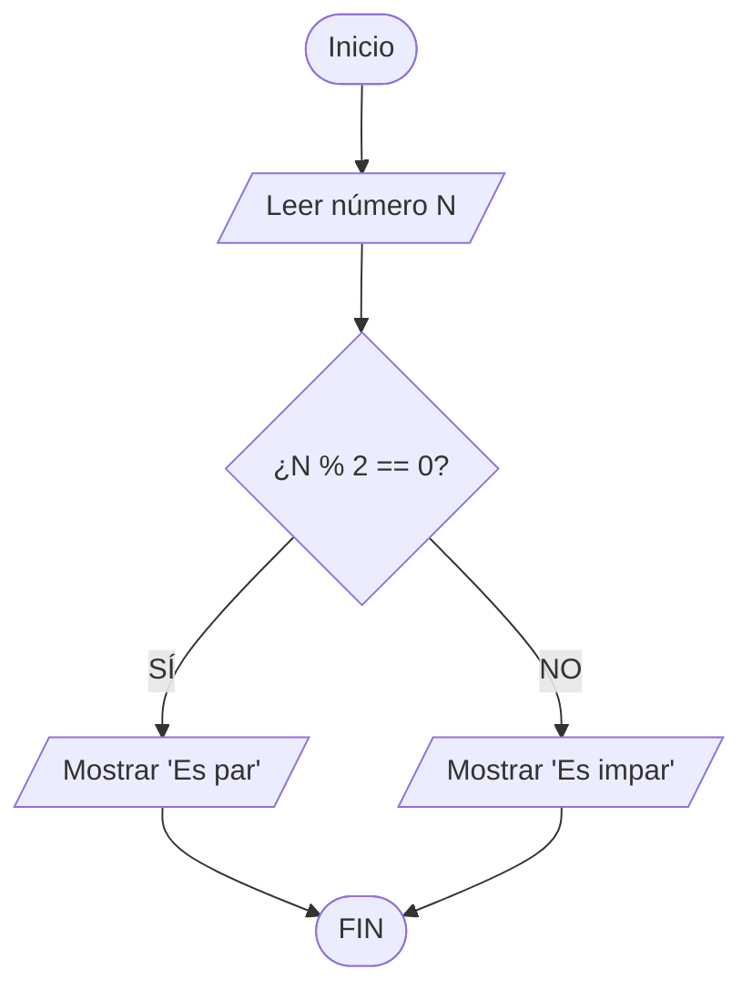
```mermaid
graph TD
    A([Inicio]) --> B[/"Leer número N"/]
    B --> C{"¿N % 2 == 0?"}
    C -- SÍ --> D[/"Mostrar 'Es par'"/]
    C -- NO --> E[/"Mostrar 'Es impar'"/]
    D --> F([FIN])
    E --> F
```

---

#### 1.5 Ejemplos prácticos

**Ejemplo 1 — Calcular el promedio de dos notas:**

```
INICIO
  Leer nota1
  Leer nota2
  promedio ← (nota1 + nota2) / 2
  Escribir "El promedio es: ", promedio
FIN
```

```python
nota1 = float(input("Nota 1: "))
nota2 = float(input("Nota 2: "))
promedio = (nota1 + nota2) / 2
print("El promedio es:", promedio)
```

**Ejemplo en C#:**
```csharp
Console.Write("Nota 1: ");
double nota1 = double.Parse(Console.ReadLine());
Console.Write("Nota 2: ");
double nota2 = double.Parse(Console.ReadLine());
double promedio = (nota1 + nota2) / 2;
Console.WriteLine("El promedio es: " + promedio);
```

**Diagrama de flujo (Mermaid):**
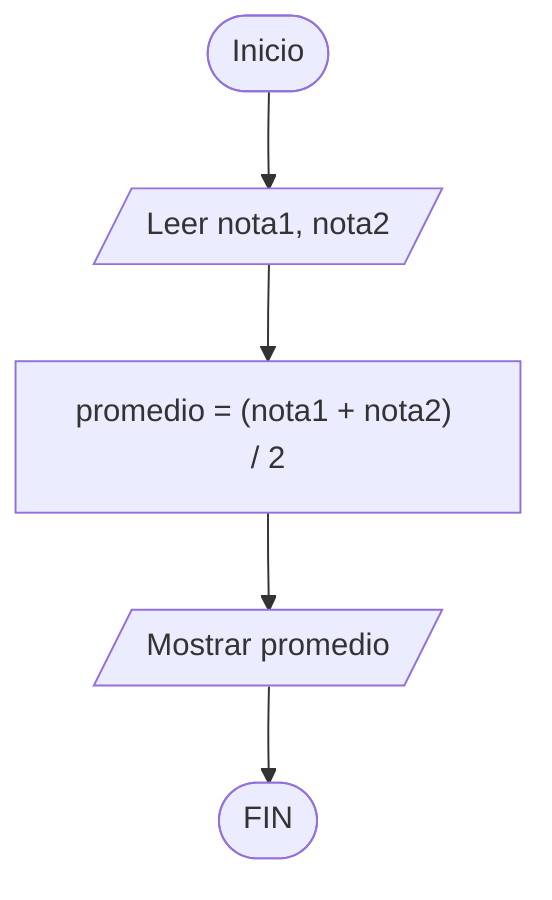
```mermaid
graph TD
    A([Inicio]) --> B[/"Leer nota1, nota2"/]
    B --> C["promedio = (nota1 + nota2) / 2"]
    C --> D[/"Mostrar promedio"/]
    D --> E([FIN])
```

**Ejemplo 2 — Convertir temperatura de Celsius a Fahrenheit:**

Fórmula: `F = (C × 9/5) + 32`

```python
celsius = float(input("Temperatura en Celsius: "))
fahrenheit = (celsius * 9 / 5) + 32
print("En Fahrenheit:", fahrenheit)
```

**Ejemplo en C#:**
```csharp
Console.Write("Temperatura en Celsius: ");
double celsius = double.Parse(Console.ReadLine());
double fahrenheit = (celsius * 9 / 5) + 32;
Console.WriteLine("En Fahrenheit: " + fahrenheit);
```

**Diagrama de flujo (Mermaid):**
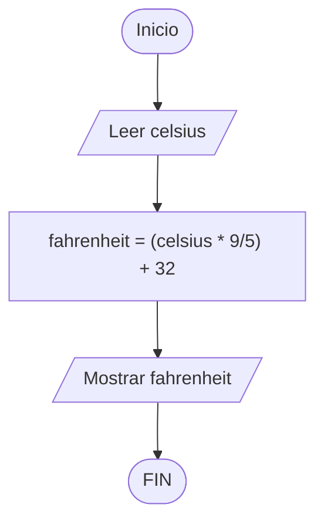
```mermaid
graph TD
    A([Inicio]) --> B[/"Leer celsius"/]
    B --> C["fahrenheit = (celsius * 9/5) + 32"]
    C --> D[/"Mostrar fahrenheit"/]
    D --> E([FIN])
```

---

### 🛠️ TALLER INDIVIDUAL — Clase 1
#### "Mi primer algoritmo del mundo real"

> ⏱️ **Tiempo:** 35 minutos  
> 📝 **Formato:** Hoja física entregada por el profesor (no digital, para reducir copia)

**Instrucciones generales:**
- Trabaja solo/a. No se permite hablar durante el taller.
- Debes mostrar el diagrama de flujo, el pseudocódigo y el código en Python.
- Cada estudiante recibe un problema **diferente** (el profesor asigna según número de lista).

---

**🔢 Grupo A (números impares de lista):**
Una tienda de dulces cobra $500 por cada dulce. Si el cliente compra más de 10 dulces, le aplica un descuento del 15%.
- Entradas: cantidad de dulces comprados.
- Salidas: precio total a pagar.

**🔢 Grupo B (números pares de lista):**
Un estudiante tiene 3 materias. Para pasar el año necesita un promedio mayor o igual a 3.0.
- Entradas: las 3 notas.
- Salidas: el promedio y si pasa o no pasa.

**🔢 Grupo C (nacidos en enero–junio):**
Una piscina cobra $8.000 por adulto y $5.000 por niño (menor de 12 años). Calcula el total a pagar para un grupo de visitantes.
- Entradas: cantidad de adultos, cantidad de niños.
- Salidas: total a pagar.

> 📌 **Estrategia anti-copia:** Problemas personalizados por grupo + entrega en hoja física + el profesor cambia los valores numéricos en cada versión impresa.

---

---

# 🟩 CLASE 2
## Variables, Tipos de Datos y Operadores

> **Duración:** 3 horas · Descanso a los 90 minutos

---

### 🎯 Objetivos de la clase
- Entender qué es una variable y cómo usarla.
- Identificar los tipos de datos básicos.
- Aplicar operadores aritméticos, relacionales y lógicos.

---

### ⏱️ Distribución del tiempo

| Bloque | Actividad | Tiempo |
|--------|-----------|--------|
| 1 | Variables y asignación | 30 min |
| 2 | Tipos de datos | 25 min |
| 3 | Operadores aritméticos | 20 min |
| — | ☕ **DESCANSO** | 15 min |
| 4 | Operadores relacionales y lógicos | 30 min |
| 5 | Ejemplos prácticos | 20 min |
| 6 | 🛠️ Taller individual | 40 min |

---

### 📖 Contenido

#### 2.1 Variables

Una **variable** es un espacio en la memoria del computador donde se guarda un valor. Tiene un nombre y un tipo.

> 💡 **Metáfora:** Una variable es como una caja con una etiqueta. La etiqueta es el nombre de la variable; lo que hay dentro es el valor.

```python
edad = 15          # Variable entera
nombre = "Carlos"  # Variable de texto
precio = 9.99      # Variable decimal
activo = True      # Variable booleana
```

**Equivalente en C#:**
```csharp
int edad = 15;
string nombre = "Carlos";
double precio = 9.99;
bool activo = true;
```

**Reglas para nombrar variables:**
- Deben comenzar con letra o guión bajo (_).
- No pueden tener espacios (usa `_` en su lugar: `mi_nombre`).
- Son sensibles a mayúsculas: `Edad` ≠ `edad`.
- No pueden ser palabras reservadas: `if`, `for`, `while`, etc.

**Asignación:**
```python
x = 10       # x vale 10
x = x + 5   # ahora x vale 15
```

---

#### 2.2 Tipos de datos

| Tipo | Nombre en Python | Ejemplo | Descripción |
|------|-----------------|---------|-------------|
| Entero | `int` | `5`, `-3`, `100` | Números sin decimales |
| Decimal | `float` | `3.14`, `-0.5` | Números con decimales |
| Texto | `str` | `"Hola"`, `'mundo'` | Cadenas de caracteres |
| Booleano | `bool` | `True`, `False` | Verdadero o Falso |

```python
# Verificar el tipo de una variable
print(type(15))       # <class 'int'>
print(type(3.14))     # <class 'float'>
print(type("Hola"))   # <class 'str'>
print(type(True))     # <class 'bool'>
```

**Conversión de tipos:**
```python
texto = "25"
numero = int(texto)    # Convierte texto a entero
decimal = float("3.7") # Convierte texto a decimal
cadena = str(100)      # Convierte número a texto
```

**Equivalente en C#:**
```csharp
string texto = "25";
int numero = int.Parse(texto);
double decimal = double.Parse("3.7");
string cadena = 100.ToString();
```

---

#### 2.3 Operadores aritméticos

| Operador | Símbolo | Ejemplo | Resultado |
|----------|---------|---------|-----------|
| Suma | `+` | `5 + 3` | `8` |
| Resta | `-` | `10 - 4` | `6` |
| Multiplicación | `*` | `6 * 7` | `42` |
| División | `/` | `10 / 3` | `3.333...` |
| División entera | `//` | `10 // 3` | `3` |
| Módulo (residuo) | `%` | `10 % 3` | `1` |
| Potencia | `**` | `2 ** 8` | `256` |

```python
a = 17
b = 5
print(a + b)   # 22
print(a - b)   # 12
print(a * b)   # 85
print(a / b)   # 3.4
print(a // b)  # 3
print(a % b)   # 2
print(a ** b)  # 1419857
```

**Equivalente en C#:**
```csharp
int a = 17;
int b = 5;
Console.WriteLine(a + b);   // 22
Console.WriteLine(a - b);   // 12
Console.WriteLine(a * b);   // 85
Console.WriteLine((double)a / b); // 3.4
Console.WriteLine(a / b);   // 3 (división entera)
Console.WriteLine(a % b);   // 2
Console.WriteLine(Math.Pow(a, b)); // 1419857
```

---

#### 2.4 Operadores relacionales

Comparan dos valores y **devuelven** `True` o `False`.

| Operador | Significado | Ejemplo | Resultado |
|----------|-------------|---------|-----------|
| `==` | Igual a | `5 == 5` | `True` |
| `!=` | Diferente de | `5 != 3` | `True` |
| `>` | Mayor que | `7 > 3` | `True` |
| `<` | Menor que | `2 < 1` | `False` |
| `>=` | Mayor o igual | `5 >= 5` | `True` |
| `<=` | Menor o igual | `4 <= 3` | `False` |

---

#### 2.5 Operadores lógicos

Combinan condiciones.

| Operador | Significado | Ejemplo | Resultado |
|----------|-------------|---------|-----------|
| `and` | Y (ambas deben ser verdaderas) | `True and False` | `False` |
| `or` | O (al menos una verdadera) | `True or False` | `True` |
| `not` | No (invierte el resultado) | `not True` | `False` |

```python
edad = 17
tiene_permiso = True

# Puede entrar si tiene 18+ O tiene permiso
puede_entrar = (edad >= 18) or tiene_permiso
print(puede_entrar)  # True
```

**Equivalente en C#:**
```csharp
int edad = 17;
bool tienePermiso = true;

bool puedeEntrar = (edad >= 18) || tienePermiso;
Console.WriteLine(puedeEntrar); // True
```

---

#### 2.6 Ejemplos prácticos

**Ejemplo 1 — Calcular el área de un triángulo:**
```python
base = float(input("Base del triángulo (cm): "))
altura = float(input("Altura del triángulo (cm): "))
area = (base * altura) / 2
print(f"El área es: {area} cm²")
```

**Ejemplo en C#:**
```csharp
Console.Write("Base del triángulo (cm): ");
double baseTri = double.Parse(Console.ReadLine());
Console.Write("Altura del triángulo (cm): ");
double altura = double.Parse(Console.ReadLine());
double area = (baseTri * altura) / 2;
Console.WriteLine($"El área es: {area} cm²");
```

**Diagrama de flujo (Mermaid):**
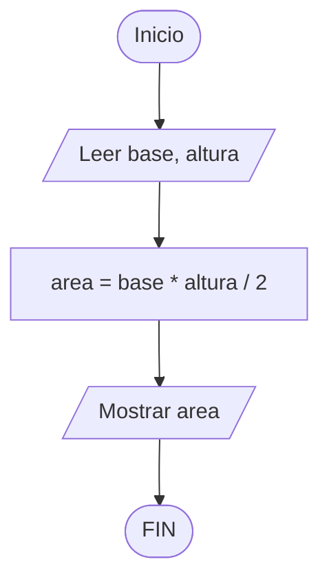
```mermaid
graph TD
    A([Inicio]) --> B[/"Leer base, altura"/]
    B --> C["area = base * altura / 2"]
    C --> D[/"Mostrar area"/]
    D --> E([FIN])
```

**Ejemplo 2 — ¿Cuántos años faltan para ser mayor de edad?**
```python
edad = int(input("¿Cuántos años tienes? "))
faltan = 18 - edad
if faltan > 0:
    print(f"Te faltan {faltan} años para ser mayor de edad.")
elif faltan == 0:
    print("¡Acabas de cumplir 18 años!")
else:
    print(f"Ya eres mayor de edad (hace {-faltan} años).")
```

**Ejemplo en C#:**
```csharp
Console.Write("¿Cuántos años tienes? ");
int edad = int.Parse(Console.ReadLine());
int faltan = 18 - edad;
if (faltan > 0) {
    Console.WriteLine($"Te faltan {faltan} años para ser mayor de edad.");
} else if (faltan == 0) {
    Console.WriteLine("¡Acabas de cumplir 18 años!");
} else {
    Console.WriteLine($"Ya eres mayor de edad (hace {-faltan} años).");
}
```

**Diagrama de flujo (Mermaid):**
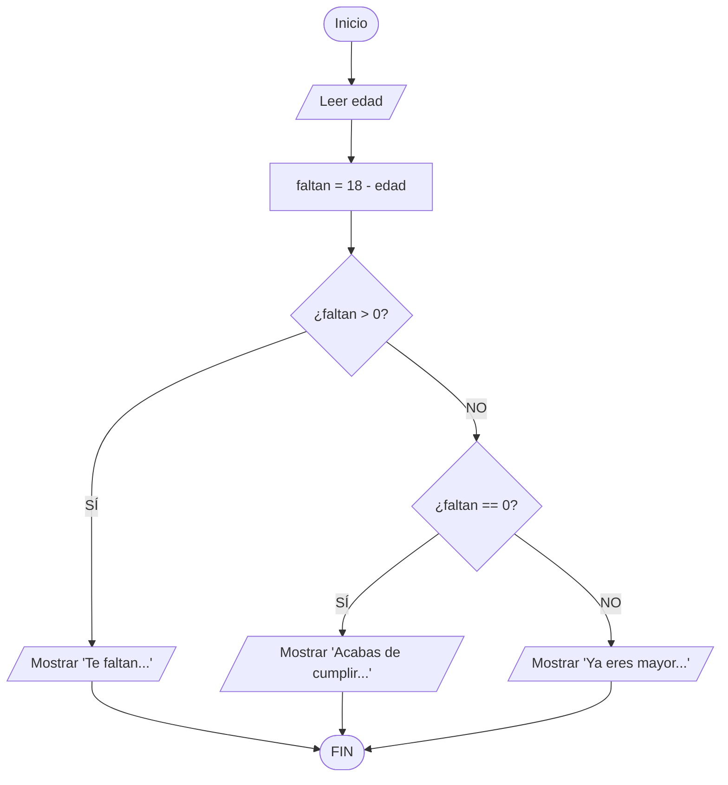
```mermaid
graph TD
    A([Inicio]) --> B[/"Leer edad"/]
    B --> C["faltan = 18 - edad"]
    C --> D{"¿faltan > 0?"}
    D -- SÍ --> E[/"Mostrar 'Te faltan...'"/]
    D -- NO --> F{"¿faltan == 0?"}
    F -- SÍ --> G[/"Mostrar 'Acabas de cumplir...'"/]
    F -- NO --> H[/"Mostrar 'Ya eres mayor...'"/]
    E --> I([FIN])
    G --> I
    H --> I
```

---

### 🛠️ TALLER INDIVIDUAL — Clase 2
#### "Calculadora personalizada"

> ⏱️ **Tiempo:** 40 minutos  
> 📝 **Entrega:** Código escrito a mano en papel cuadriculado + ejecución verificada por el profesor

Cada estudiante recibe un **escenario único** según su fecha de nacimiento:

**Grupo Enero–Marzo:**
Calcula el costo total de pintar una habitación rectangular. Se conocen el largo, el ancho y la altura de la habitación, y el costo por metro cuadrado de pintura. (Pinta solo las 4 paredes, no el piso ni el techo.)

**Grupo Abril–Junio:**
Un motociclista recorre cierta distancia en kilómetros. Su moto consume un litro de gasolina cada 45 km. Si la gasolina cuesta $12.500 el litro, ¿cuánto gasta en gasolina para ese viaje?

**Grupo Julio–Septiembre:**
Calcula el índice de masa corporal (IMC = peso / altura²). Muestra el resultado e indica si es bajo peso (< 18.5), normal (18.5–24.9) o sobrepeso (≥ 25).

**Grupo Octubre–Diciembre:**
Una heladería vende 3 sabores: fresa ($3.500), chocolate ($4.000) y vainilla ($3.000). El cliente puede pedir hasta 3 bolas. Calcula el total a pagar dado el sabor y la cantidad de bolas de cada tipo.

> 📌 **Estrategia anti-copia:** Agrupación por mes de nacimiento (impredecible), entrega manuscrita, el profesor circula el salón durante la prueba.

---

---

# 🟨 CLASE 3
## Estructuras de Decisión

> **Duración:** 3 horas · Descanso a los 90 minutos

---

### 🎯 Objetivos de la clase
- Usar `if`, `else` y `elif` para tomar decisiones en un programa.
- Anidar condiciones para resolver problemas más complejos.
- Aplicar decisiones a problemas del mundo real.

---

### ⏱️ Distribución del tiempo

| Bloque | Actividad | Tiempo |
|--------|-----------|--------|
| 1 | Repaso clase anterior + motivación | 15 min |
| 2 | if / else básico | 30 min |
| 3 | elif y múltiples condiciones | 25 min |
| — | ☕ **DESCANSO** | 15 min |
| 4 | Condiciones anidadas | 25 min |
| 5 | Ejemplos prácticos | 25 min |
| 6 | 🛠️ Taller individual | 45 min |

---

### 📖 Contenido

#### 3.1 Estructura if / else

Permite ejecutar bloques de código según una condición.

**Sintaxis básica:**
```python
if condicion:
    # Código si la condición es VERDADERA
else:
    # Código si la condición es FALSA
```

**Ejemplo:**
```python
temperatura = float(input("¿Cuál es la temperatura? "))
if temperatura >= 30:
    print("Hace mucho calor. ¡Usa ropa ligera!")
else:
    print("El clima está fresco.")
```

**Ejemplo en C#:**
```csharp
Console.Write("¿Cuál es la temperatura? ");
double temperatura = double.Parse(Console.ReadLine());
if (temperatura >= 30) {
    Console.WriteLine("Hace mucho calor. ¡Usa ropa ligera!");
} else {
    Console.WriteLine("El clima está fresco.");
}
```

**Diagrama de flujo (Mermaid):**
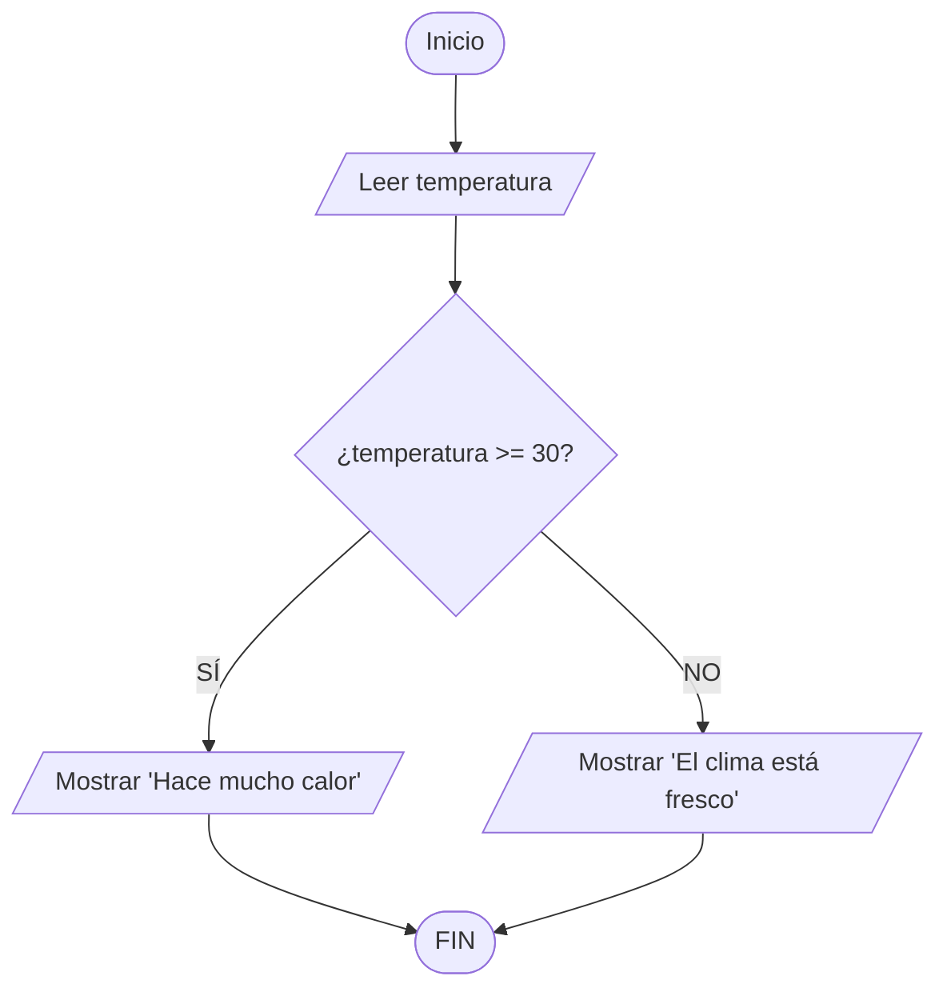
```mermaid
graph TD
    A([Inicio]) --> B[/"Leer temperatura"/]
    B --> C{"¿temperatura >= 30?"}
    C -- SÍ --> D[/"Mostrar 'Hace mucho calor'"/]
    C -- NO --> E[/"Mostrar 'El clima está fresco'"/]
    D --> F([FIN])
    E --> F
```

> ⚠️ **Importante:** En Python, la **indentación** (sangría) es obligatoria. Todo lo que va dentro de un `if` debe estar desplazado 4 espacios.

---

#### 3.2 Estructura elif

Cuando hay más de dos posibilidades, usamos `elif` (abreviación de "else if").

```python
if condicion1:
    # Bloque 1
elif condicion2:
    # Bloque 2
elif condicion3:
    # Bloque 3
else:
    # Bloque por defecto
```

**Ejemplo — Clasificar una nota:**
```python
nota = float(input("Ingresa tu nota (0-5): "))

if nota >= 4.5:
    print("¡Excelente!")
elif nota >= 4.0:
    print("Sobresaliente")
elif nota >= 3.5:
    print("Aceptable")
elif nota >= 3.0:
    print("Aprobado")
else:
    print("Reprobado")
```

**Ejemplo en C#:**
```csharp
Console.Write("Ingresa tu nota (0-5): ");
double nota = double.Parse(Console.ReadLine());

if (nota >= 4.5) {
    Console.WriteLine("¡Excelente!");
} else if (nota >= 4.0) {
    Console.WriteLine("Sobresaliente");
} else if (nota >= 3.5) {
    Console.WriteLine("Aceptable");
} else if (nota >= 3.0) {
    Console.WriteLine("Aprobado");
} else {
    Console.WriteLine("Reprobado");
}
```

**Diagrama de flujo (Mermaid):**
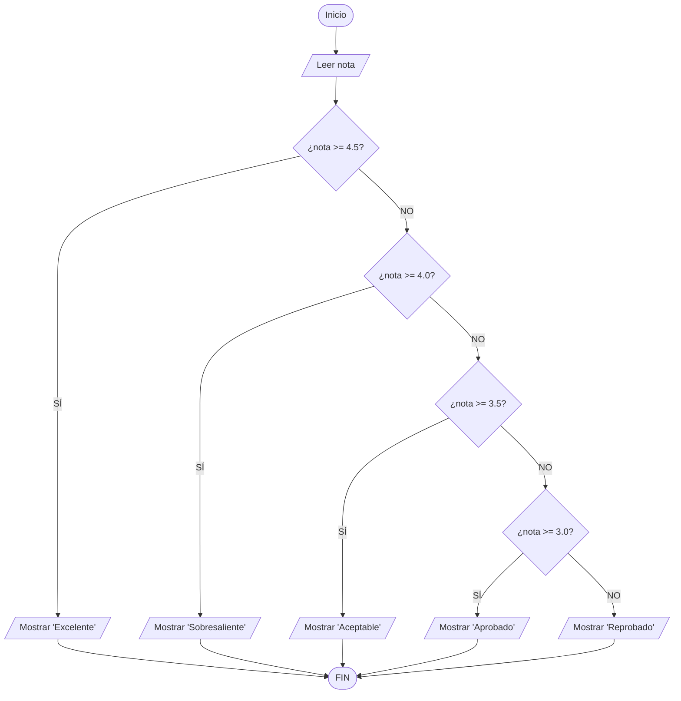
```mermaid
graph TD
    A([Inicio]) --> B[/"Leer nota"/]
    B --> C{"¿nota >= 4.5?"}
    C -- SÍ --> D[/"Mostrar 'Excelente'"/]
    C -- NO --> E{"¿nota >= 4.0?"}
    E -- SÍ --> F[/"Mostrar 'Sobresaliente'"/]
    E -- NO --> G{"¿nota >= 3.5?"}
    G -- SÍ --> H[/"Mostrar 'Aceptable'"/]
    G -- NO --> I{"¿nota >= 3.0?"}
    I -- SÍ --> J[/"Mostrar 'Aprobado'"/]
    I -- NO --> K[/"Mostrar 'Reprobado'"/]
    D --> L([FIN])
    F --> L
    H --> L
    J --> L
    K --> L
```

---

#### 3.3 Condiciones anidadas

Un `if` puede contener otro `if` dentro (anidamiento).

```python
edad = int(input("¿Cuántos años tienes? "))
tiene_carnet = input("¿Tienes carnet de conducción? (si/no): ")

if edad >= 18:
    if tiene_carnet == "si":
        print("Puedes conducir.")
    else:
        print("Eres mayor de edad, pero necesitas el carnet.")
else:
    print("Eres menor de edad. No puedes conducir.")
```

**Equivalente en C#:**
```csharp
Console.Write("¿Cuántos años tienes? ");
int edad = int.Parse(Console.ReadLine());
Console.Write("¿Tienes carnet de conducción? (si/no): ");
string tieneCarnet = Console.ReadLine();

if (edad >= 18) {
    if (tieneCarnet == "si") {
        Console.WriteLine("Puedes conducir.");
    } else {
        Console.WriteLine("Eres mayor de edad, pero necesitas el carnet.");
    }
} else {
    Console.WriteLine("Eres menor de edad. No puedes conducir.");
}
```

> 💡 A veces es más claro usar `and` / `or` en lugar de anidar:
```python
if edad >= 18 and tiene_carnet == "si":
    print("Puedes conducir.")
```

---

#### 3.4 Ejemplos prácticos

**Ejemplo 1 — Sistema de acceso:**
```python
usuario = input("Usuario: ")
clave = input("Contraseña: ")

if usuario == "admin" and clave == "1234":
    print("Bienvenido al sistema.")
else:
    print("Acceso denegado.")
```

**Ejemplo en C#:**
```csharp
Console.Write("Usuario: ");
string usuario = Console.ReadLine();
Console.Write("Contraseña: ");
string clave = Console.ReadLine();

if (usuario == "admin" && clave == "1234") {
    Console.WriteLine("Bienvenido al sistema.");
} else {
    Console.WriteLine("Acceso denegado.");
}
```

**Diagrama de flujo (Mermaid):**
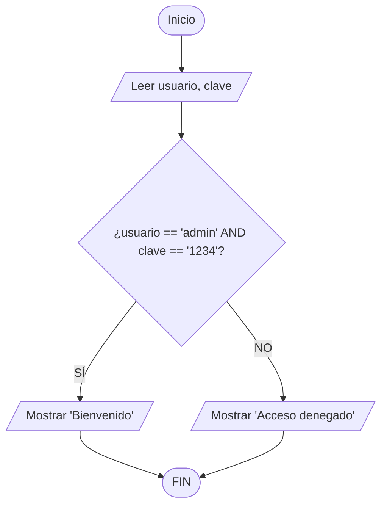
```mermaid
graph TD
    A([Inicio]) --> B[/"Leer usuario, clave"/]
    B --> C{"¿usuario == 'admin' AND clave == '1234'?"}
    C -- SÍ --> D[/"Mostrar 'Bienvenido'"/]
    C -- NO --> E[/"Mostrar 'Acceso denegado'"/]
    D --> F([FIN])
    E --> F
```

**Ejemplo 2 — Calculadora con operaciones:**
```python
a = float(input("Primer número: "))
operacion = input("Operación (+, -, *, /): ")
b = float(input("Segundo número: "))

if operacion == "+":
    print("Resultado:", a + b)
elif operacion == "-":
    print("Resultado:", a - b)
elif operacion == "*":
    print("Resultado:", a * b)
elif operacion == "/":
    if b != 0:
        print("Resultado:", a / b)
    else:
        print("Error: no se puede dividir entre cero.")
else:
    print("Operación no válida.")
```

**Ejemplo en C#:**
```csharp
Console.Write("Primer número: ");
double a = double.Parse(Console.ReadLine());
Console.Write("Operación (+, -, *, /): ");
string operacion = Console.ReadLine();
Console.Write("Segundo número: ");
double b = double.Parse(Console.ReadLine());

if (operacion == "+") {
    Console.WriteLine("Resultado: " + (a + b));
} else if (operacion == "-") {
    Console.WriteLine("Resultado: " + (a - b));
} else if (operacion == "*") {
    Console.WriteLine("Resultado: " + (a * b));
} else if (operacion == "/") {
    if (b != 0) {
        Console.WriteLine("Resultado: " + (a / b));
    } else {
        Console.WriteLine("Error: no se puede dividir entre cero.");
    }
} else {
    Console.WriteLine("Operación no válida.");
}
```

**Diagrama de flujo (Mermaid):**
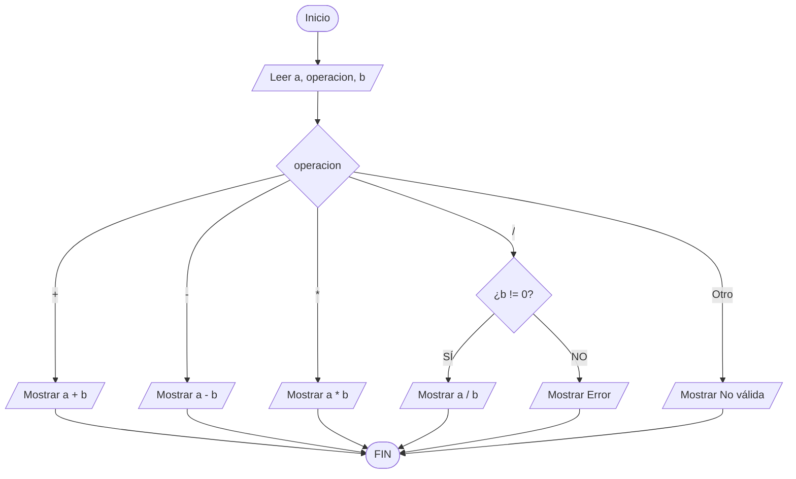
```mermaid
graph TD
    A([Inicio]) --> B[/"Leer a, operacion, b"/]
    B --> C{operacion}
    C -- "+" --> D[/"Mostrar a + b"/]
    C -- "-" --> E[/"Mostrar a - b"/]
    C -- "*" --> F[/"Mostrar a * b"/]
    C -- "/" --> G{"¿b != 0?"}
    G -- SÍ --> H[/"Mostrar a / b"/]
    G -- NO --> I[/"Mostrar Error"/]
    C -- Otro --> J[/"Mostrar No válida"/]
    D --> K([FIN])
    E --> K
    F --> K
    H --> K
    I --> K
    J --> K
```

---

### 🛠️ TALLER INDIVIDUAL — Clase 3
#### "Simulador de decisiones"

> ⏱️ **Tiempo:** 45 minutos  
> 📝 **Formato:** Código escrito a mano. El profesor asigna el problema oralmente y en secreto a cada estudiante.

**Tipo A — Clasificador de triángulos:**
Dados tres lados (a, b, c), determinar si forman un triángulo válido (la suma de dos lados siempre debe ser mayor que el tercero). Si es válido, clasificarlo como: equilátero (todos iguales), isósceles (dos iguales) o escaleno (todos diferentes).

**Tipo B — Semáforo inteligente:**
Un semáforo muestra: verde (0–30 seg), amarillo (31–35 seg), rojo (36–60 seg). Dado el segundo actual del ciclo, indica qué color muestra el semáforo y cuántos segundos faltan para cambiar al siguiente color.

**Tipo C — Tarifa de taxi:**
Un taxi cobra: $5.000 de arranque + $800 por km. Si el viaje es nocturno (entre 10pm y 5am), aplica un recargo del 30%. Si el cliente es mayor de 65 años, tiene descuento del 20%. Calcula el total a pagar.

**Tipo D — Clasificación de un año:**
Dado un año, determinar si es bisiesto. Un año es bisiesto si es divisible entre 4, EXCEPTO los siglos (divisibles entre 100), a menos que también sean divisibles entre 400.

> 📌 **Estrategia anti-copia:** Problema asignado oralmente en privado. Los valores de ejemplo de cada enunciado varían por estudiante.

---

---

# 🟧 CLASE 4
## Ciclos: while y for

> **Duración:** 3 horas · Descanso a los 90 minutos

---

### 🎯 Objetivos de la clase
- Usar `while` para repetir acciones mientras una condición sea verdadera.
- Usar `for` para iterar una cantidad determinada de veces.
- Combinar ciclos con condiciones.

---

### ⏱️ Distribución del tiempo

| Bloque | Actividad | Tiempo |
|--------|-----------|--------|
| 1 | Motivación: ¿por qué necesitamos ciclos? | 15 min |
| 2 | Ciclo while | 35 min |
| 3 | Ciclo for y range() | 30 min |
| — | ☕ **DESCANSO** | 15 min |
| 4 | break y continue | 20 min |
| 5 | Ejemplos prácticos | 20 min |
| 6 | 🛠️ Taller individual | 45 min |

---

### 📖 Contenido

#### 4.1 ¿Por qué necesitamos ciclos?

Imagina que tienes que sumar los números del 1 al 100. Podrías escribir 100 líneas de código... o usar un ciclo. Los ciclos permiten **repetir instrucciones** sin escribirlas múltiples veces.

> 💡 **Metáfora:** Un ciclo es como una lavadora: repite el ciclo de lavado X veces hasta que la ropa esté limpia.

---

#### 4.2 Ciclo while

Se repite **mientras** una condición sea verdadera.

```python
while condicion:
    # Código a repetir
```

**Ejemplo — Contador:**
```python
contador = 1
while contador <= 5:
    print("Vuelta número:", contador)
    contador += 1  # IMPORTANTE: siempre actualizar la condición
print("¡Ciclo terminado!")
```

**Ejemplo en C#:**
```csharp
int contador = 1;
while (contador <= 5) {
    Console.WriteLine("Vuelta número: " + contador);
    contador++;
}
Console.WriteLine("¡Ciclo terminado!");
```

**Diagrama de flujo (Mermaid):**
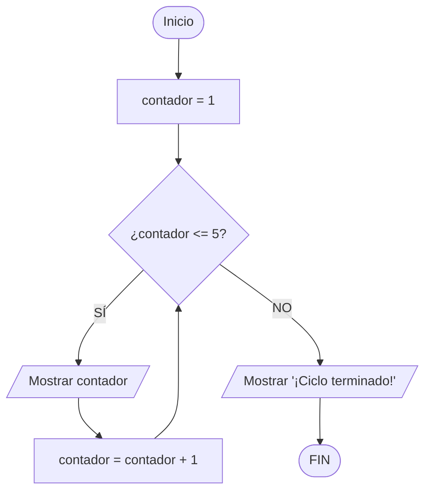
```mermaid
graph TD
    A([Inicio]) --> B["contador = 1"]
    B --> C{"¿contador <= 5?"}
    C -- SÍ --> D[/"Mostrar contador"/]
    D --> E["contador = contador + 1"]
    E --> C
    C -- NO --> F[/"Mostrar '¡Ciclo terminado!'"/]
    F --> G([FIN])
```

> ⚠️ **Ciclo infinito:** Si la condición nunca se vuelve falsa, el programa nunca termina. ¡Siempre modifica la variable de control!

**Ejemplo — Validar entrada del usuario:**
```python
edad = int(input("Ingresa tu edad: "))
while edad < 0 or edad > 120:
    print("Edad no válida. Intenta de nuevo.")
    edad = int(input("Ingresa tu edad: "))
print("Edad registrada:", edad)
```

**Ejemplo en C#:**
```csharp
Console.Write("Ingresa tu edad: ");
int edad = int.Parse(Console.ReadLine());
while (edad < 0 || edad > 120) {
    Console.WriteLine("Edad no válida. Intenta de nuevo.");
    Console.Write("Ingresa tu edad: ");
    edad = int.Parse(Console.ReadLine());
}
Console.WriteLine("Edad registrada: " + edad);
```

**Diagrama de flujo (Mermaid):**
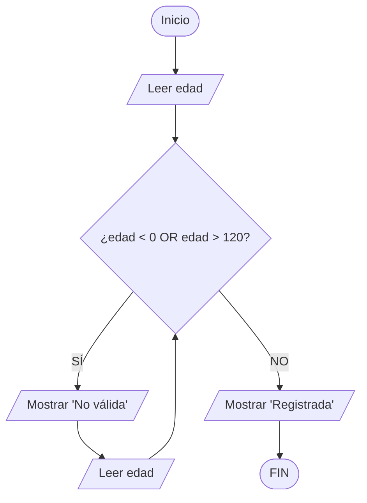
```mermaid
graph TD
    A([Inicio]) --> B[/"Leer edad"/]
    B --> C{"¿edad < 0 OR edad > 120?"}
    C -- SÍ --> D[/"Mostrar 'No válida'"/]
    D --> E[/"Leer edad"/]
    E --> C
    C -- NO --> F[/"Mostrar 'Registrada'"/]
    F --> G([FIN])
```

---

#### 4.3 Ciclo for

Se usa cuando sabemos exactamente cuántas veces queremos repetir.

```python
for variable in range(inicio, fin, paso):
    # Código a repetir
```

| Expresión | Resultado |
|-----------|-----------|
| `range(5)` | 0, 1, 2, 3, 4 |
| `range(1, 6)` | 1, 2, 3, 4, 5 |
| `range(0, 10, 2)` | 0, 2, 4, 6, 8 |
| `range(10, 0, -1)` | 10, 9, 8, ..., 1 |

**Ejemplo — Tabla de multiplicar:**
```python
numero = int(input("¿De qué número quieres la tabla? "))
for i in range(1, 11):
    print(f"{numero} x {i} = {numero * i}")
```

**Ejemplo en C#:**
```csharp
Console.Write("¿De qué número quieres la tabla? ");
int numero = int.Parse(Console.ReadLine());
for (int i = 1; i <= 10; i++) {
    Console.WriteLine($"{numero} x {i} = {numero * i}");
}
```

**Diagrama de flujo (Mermaid):**
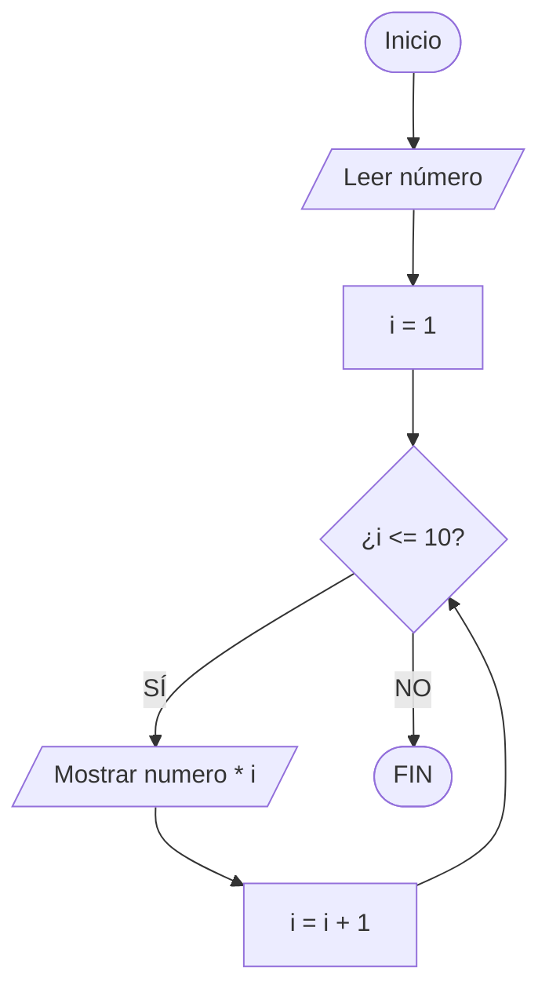
```mermaid
graph TD
    A([Inicio]) --> B[/"Leer número"/]
    B --> C["i = 1"]
    C --> D{"¿i <= 10?"}
    D -- SÍ --> E[/"Mostrar numero * i"/]
    E --> F["i = i + 1"]
    F --> D
    D -- NO --> G([FIN])
```

**Ejemplo — Sumar los números del 1 al N:**
```python
N = int(input("Ingresa N: "))
suma = 0
for i in range(1, N + 1):
    suma += i
print(f"La suma de 1 a {N} es: {suma}")
```

**Ejemplo en C#:**
```csharp
Console.Write("Ingresa N: ");
int N = int.Parse(Console.ReadLine());
int suma = 0;
for (int i = 1; i <= N; i++) {
    suma += i;
}
Console.WriteLine($"La suma de 1 a {N} es: {suma}");
```

**Diagrama de flujo (Mermaid):**
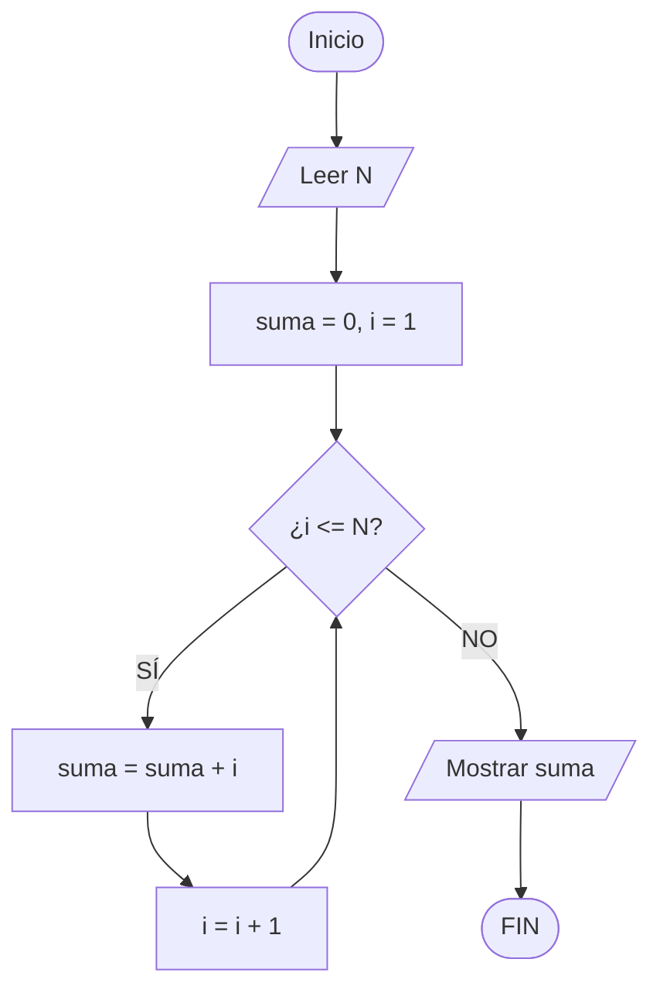
```mermaid
graph TD
    A([Inicio]) --> B[/"Leer N"/]
    B --> C["suma = 0, i = 1"]
    C --> D{"¿i <= N?"}
    D -- SÍ --> E["suma = suma + i"]
    E --> F["i = i + 1"]
    F --> D
    D -- NO --> G[/"Mostrar suma"/]
    G --> H([FIN])
```

---

#### 4.4 break y continue

- `break`: **sale** del ciclo inmediatamente.
- `continue`: **salta** a la siguiente iteración sin ejecutar el resto del bloque.

```python
# break: buscar el primer número divisible entre 7
for i in range(1, 100):
    if i % 7 == 0:
        print(f"El primer múltiplo de 7 es: {i}")
        break

# continue: imprimir solo los impares
for i in range(1, 11):
    if i % 2 == 0:
        continue  # salta los pares
    print(i)
```

**Equivalente en C#:**
```csharp
// break
for (int i = 1; i < 100; i++) {
    if (i % 7 == 0) {
        Console.WriteLine($"El primer múltiplo de 7 es: {i}");
        break;
    }
}

// continue
for (int i = 1; i <= 10; i++) {
    if (i % 2 == 0) continue;
    Console.WriteLine(i);
}
```

---

#### 4.5 Ejemplos prácticos

**Ejemplo 1 — Adivina el número:**
```python
secreto = 42
intentos = 0
while True:
    numero = int(input("Adivina el número (1-100): "))
    intentos += 1
    if numero < secreto:
        print("Muy bajo. Intenta más arriba.")
    elif numero > secreto:
        print("Muy alto. Intenta más abajo.")
    else:
        print(f"¡Correcto! Lo adivinaste en {intentos} intentos.")
        break
```

**Ejemplo en C#:**
```csharp
int secreto = 42;
int intentos = 0;
while (true) {
    Console.Write("Adivina el número (1-100): ");
    int numero = int.Parse(Console.ReadLine());
    intentos++;
    if (numero < secreto) {
        Console.WriteLine("Muy bajo. Intenta más arriba.");
    } else if (numero > secreto) {
        Console.WriteLine("Muy alto. Intenta más abajo.");
    } else {
        Console.WriteLine($"¡Correcto! Lo adivinaste en {intentos} intentos.");
        break;
    }
}
```

**Diagrama de flujo (Mermaid):**
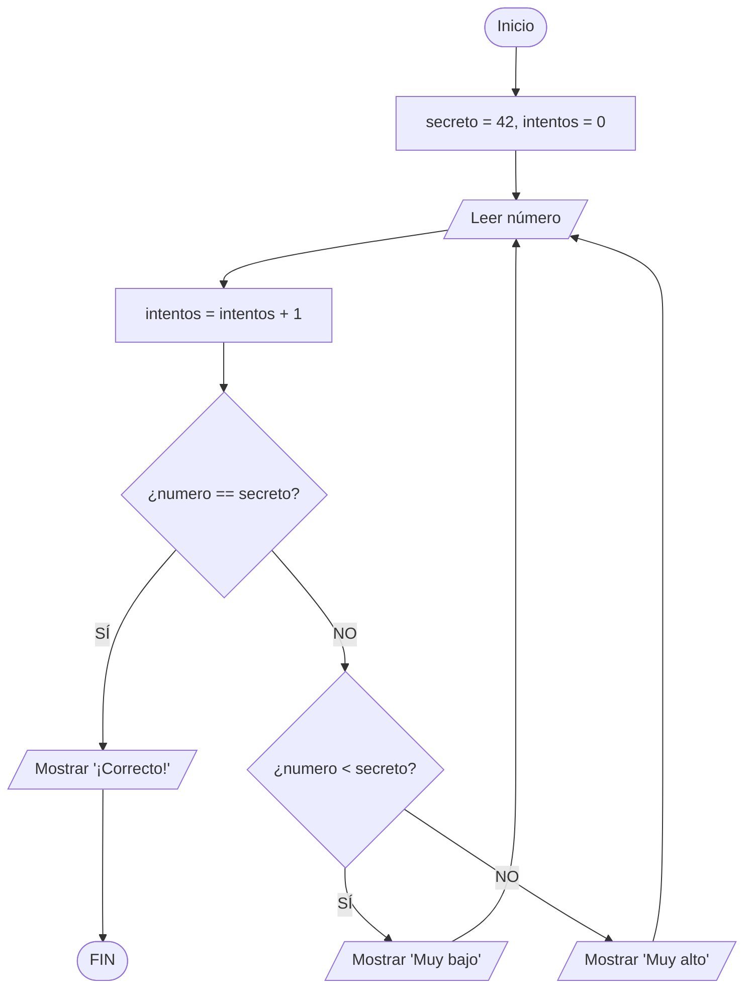
```mermaid
graph TD
    A([Inicio]) --> B["secreto = 42, intentos = 0"]
    B --> C[/"Leer número"/]
    C --> D["intentos = intentos + 1"]
    D --> E{"¿numero == secreto?"}
    E -- SÍ --> F[/"Mostrar '¡Correcto!'"/]
    F --> G([FIN])
    E -- NO --> H{"¿numero < secreto?"}
    H -- SÍ --> I[/"Mostrar 'Muy bajo'"/]
    H -- NO --> J[/"Mostrar 'Muy alto'"/]
    I --> C
    J --> C
```

**Ejemplo 2 — Factorial de N:**
```python
N = int(input("Ingresa un número: "))
factorial = 1
for i in range(1, N + 1):
    factorial *= i
print(f"{N}! = {factorial}")
```

**Ejemplo en C#:**
```csharp
Console.Write("Ingresa un número: ");
int N = int.Parse(Console.ReadLine());
long factorial = 1;
for (int i = 1; i <= N; i++) {
    factorial *= i;
}
Console.WriteLine($"{N}! = {factorial}");
```

**Diagrama de flujo (Mermaid):**
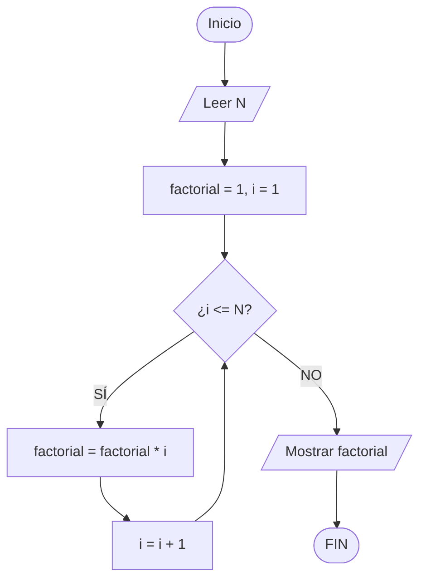
```mermaid
graph TD
    A([Inicio]) --> B[/"Leer N"/]
    B --> C["factorial = 1, i = 1"]
    C --> D{"¿i <= N?"}
    D -- SÍ --> E["factorial = factorial * i"]
    E --> F["i = i + 1"]
    F --> D
    D -- NO --> G[/"Mostrar factorial"/]
    G --> H([FIN])
```

---

### 🛠️ TALLER INDIVIDUAL — Clase 4
#### "Ciclos en acción"

> ⏱️ **Tiempo:** 45 minutos  
> 📝 **Formato:** El estudiante recibe una semilla numérica (su número de lista × 3) que debe usar en su solución.

**Problema base para todos (con variaciones):**

Escribe un programa que realice las siguientes tareas. Tu **semilla** es `S = número_de_lista × 3`:

1. Imprime todos los múltiplos de `S` que sean menores que 200.
2. Calcula la suma de todos los números entre 1 y 100 que sean divisibles entre `S` o entre `S+1`.
3. Pide al usuario que ingrese números positivos hasta que ingrese un 0. Al final, muestra: cuántos números ingresó, la suma, el mayor y el menor.

> 📌 **Estrategia anti-copia:** Semilla única por estudiante basada en su número de lista. El resultado esperado difiere para cada uno. El profesor puede verificar con una tabla de respuestas preparada.

---

---

# 🟥 CLASE 5
## Funciones y Subprogramas

> **Duración:** 3 horas · Descanso a los 90 minutos

---

### 🎯 Objetivos de la clase
- Entender qué es una función y por qué se usan.
- Crear funciones con parámetros y valor de retorno.
- Organizar el código en módulos reutilizables.

---

### ⏱️ Distribución del tiempo

| Bloque | Actividad | Tiempo |
|--------|-----------|--------|
| 1 | ¿Por qué dividir el código? | 20 min |
| 2 | Definición y llamado de funciones | 35 min |
| 3 | Parámetros y retorno | 25 min |
| — | ☕ **DESCANSO** | 15 min |
| 4 | Alcance de variables (scope) | 20 min |
| 5 | Ejemplos prácticos | 20 min |
| 6 | 🛠️ Taller individual | 45 min |

---

### 📖 Contenido

#### 5.1 ¿Qué es una función?

Una **función** es un bloque de código con nombre que realiza una tarea específica y puede ser reutilizado.

> 💡 **Metáfora:** Una función es como un electrodoméstico. Una licuadora tiene un botón ("llamada"), recibe ingredientes ("parámetros") y devuelve un batido ("valor de retorno"). No tienes que saber cómo funciona por dentro para usarla.

**Ventajas de usar funciones:**
- **Reutilización:** Escribe una vez, usa muchas veces.
- **Claridad:** El código es más fácil de leer.
- **Mantenimiento:** Si hay un error, lo corriges en un solo lugar.

---

#### 5.2 Definir y llamar funciones

```python
def nombre_funcion():
    # Código de la función
    pass

# Llamar la función
nombre_funcion()
```

**Ejemplo simple:**
```python
def saludar():
    print("¡Hola! Bienvenido al programa.")

saludar()   # Llamamos la función
saludar()   # Podemos llamarla las veces que queramos
```

**Equivalente en C#:**
```csharp
void Saludar() {
    Console.WriteLine("¡Hola! Bienvenido al programa.");
}

Saludar();
Saludar();
```

---

#### 5.3 Parámetros y argumentos

Los **parámetros** permiten pasar información a la función.

```python
def saludar(nombre):
    print(f"¡Hola, {nombre}!")

saludar("Carlos")  # Llama con argumento "Carlos"
saludar("María")   # Llama con argumento "María"
```

**Equivalente en C#:**
```csharp
void Saludar(string nombre) {
    Console.WriteLine($"¡Hola, {nombre}!");
}

Saludar("Carlos");
Saludar("María");
```

**Parámetros con valor por defecto:**
```python
def potencia(base, exponente=2):
    return base ** exponente

print(potencia(3))      # 3² = 9
print(potencia(3, 3))   # 3³ = 27
```

**Equivalente en C# (usando parámetros opcionales):**
```csharp
double Potencia(double @base, double exponente = 2) {
    return Math.Pow(@base, exponente);
}

Console.WriteLine(Potencia(3));    // 9
Console.WriteLine(Potencia(3, 3)); // 27
```

---

#### 5.4 Valor de retorno (return)

La instrucción `return` hace que la función **devuelva** un resultado.

```python
def calcular_area_circulo(radio):
    pi = 3.14159
    area = pi * radio ** 2
    return area

# Usar el valor retornado
r = float(input("Radio del círculo: "))
resultado = calcular_area_circulo(r)
print(f"El área es: {resultado:.2f}")
```

**Ejemplo en C#:**
```csharp
double CalcularAreaCirculo(double radio) {
    double pi = 3.14159;
    return pi * Math.Pow(radio, 2);
}

Console.Write("Radio del círculo: ");
double r = double.Parse(Console.ReadLine());
double resultado = CalcularAreaCirculo(r);
Console.WriteLine($"El área es: {resultado:F2}");
```

**Diagrama de flujo (Mermaid):**
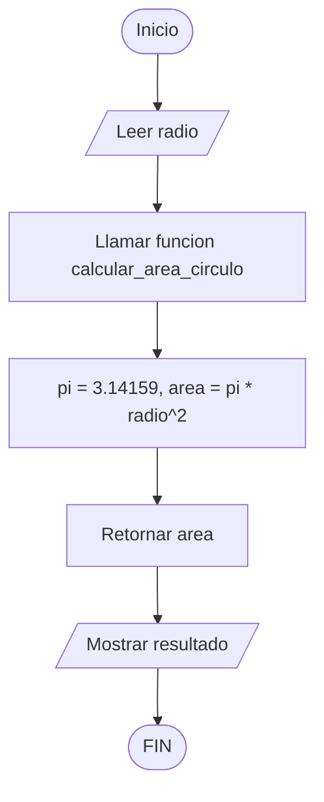
```mermaid
graph TD
    A([Inicio]) --> B[/"Leer radio"/]
    B --> C["Llamar funcion calcular_area_circulo"]
    C --> D["pi = 3.14159, area = pi * radio^2"]
    D --> E["Retornar area"]
    E --> F[/"Mostrar resultado"/]
    F --> G([FIN])
```

**Función con múltiples retornos:**
```python
def maximo_minimo(a, b, c):
    mayor = max(a, b, c)
    menor = min(a, b, c)
    return mayor, menor

grande, chico = maximo_minimo(5, 12, 3)
print("Mayor:", grande, "— Menor:", chico)
```

**Equivalente en C# (usando Tuplas):**
```csharp
(int, int) MaximoMinimo(int a, int b, int c) {
    int mayor = Math.Max(a, Math.Max(b, c));
    int menor = Math.Min(a, Math.Min(b, c));
    return (mayor, menor);
}

var (grande, chico) = MaximoMinimo(5, 12, 3);
Console.WriteLine($"Mayor: {grande} — Menor: {chico}");
```

---

#### 5.5 Alcance de variables (scope)

Las variables dentro de una función son **locales**: solo existen dentro de ella.

```python
def mi_funcion():
    x = 10  # Variable local
    print(x)

mi_funcion()
# print(x)  # ¡ERROR! x no existe fuera de la función
```

**Concepto en C#:**
```csharp
void MiFuncion() {
    int x = 10; // Variable local
    Console.WriteLine(x);
}
// Console.WriteLine(x); // ¡ERROR! x no existe fuera
```

Las variables **globales** se definen fuera de todas las funciones:
```python
PI = 3.14159  # Variable global

def area_circulo(r):
    return PI * r ** 2  # Puede leer PI
```

**Concepto en C#:**
```csharp
// Las variables globales se definen como campos estáticos en una clase
class Programa {
    static double PI = 3.14159; 

    static double AreaCirculo(double r) {
        return PI * Math.Pow(r, 2);
    }
}
```

---

#### 5.6 Ejemplos prácticos

**Ejemplo 1 — Librería de conversiones:**
```python
def celsius_a_fahrenheit(c):
    return (c * 9/5) + 32

def fahrenheit_a_celsius(f):
    return (f - 32) * 5/9

def km_a_millas(km):
    return km * 0.621371

print(celsius_a_fahrenheit(100))  # 212.0
print(fahrenheit_a_celsius(32))   # 0.0
print(km_a_millas(10))            # 6.21371
```

**Ejemplo en C#:**
```csharp
double CelsiusAFahrenheit(double c) => (c * 9 / 5) + 32;
double FahrenheitACelsius(double f) => (f - 32) * 5 / 9;
double KmaMillas(double km) => km * 0.621371;

Console.WriteLine(CelsiusAFahrenheit(100)); // 212.0
Console.WriteLine(FahrenheitACelsius(32));  // 0.0
Console.WriteLine(KmaMillas(10));           // 6.21371
```

**Ejemplo 2 — Verificador de número primo:**
```python
def es_primo(n):
    if n < 2:
        return False
    for i in range(2, int(n**0.5) + 1):
        if n % i == 0:
            return False
    return True

for num in range(1, 30):
    if es_primo(num):
        print(num, end=" ")
# Salida: 2 3 5 7 11 13 17 19 23 29
```

**Ejemplo en C#:**
```csharp
bool EsPrimo(int n) {
    if (n < 2) return false;
    for (int i = 2; i <= Math.Sqrt(n); i++) {
        if (n % i == 0) return false;
    }
    return true;
}

for (int num = 1; num < 30; num++) {
    if (EsPrimo(num)) Console.Write(num + " ");
}
```

**Diagrama de flujo (Mermaid):**
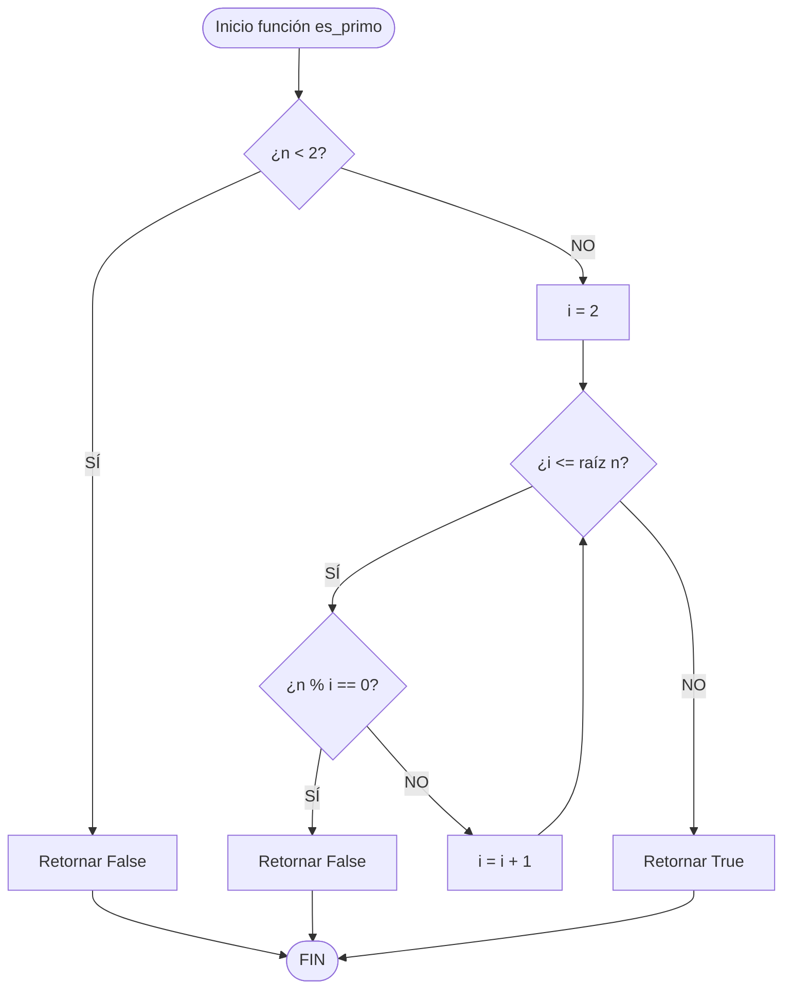
```mermaid
graph TD
    A([Inicio función es_primo]) --> B{"¿n < 2?"}
    B -- SÍ --> C["Retornar False"]
    B -- NO --> D["i = 2"]
    D --> E{"¿i <= raíz n?"}
    E -- SÍ --> F{"¿n % i == 0?"}
    F -- SÍ --> G["Retornar False"]
    F -- NO --> H["i = i + 1"]
    H --> E
    E -- NO --> I["Retornar True"]
    C --> J([FIN])
    G --> J
    I --> J
```

---

### 🛠️ TALLER INDIVIDUAL — Clase 5
#### "Mi mini-librería matemática"

> ⏱️ **Tiempo:** 45 minutos  
> 📝 **Formato:** Código a mano + explicación oral breve al professor (2 min por estudiante al final)

**Instrucción:** Crea una mini-librería con exactamente **4 funciones**. Cada estudiante elige su temática del siguiente listado (sin repetir con compañeros cercanos):

- 🏋️ Fitness: IMC, calorías quemadas, frecuencia cardíaca máxima, tiempo estimado de carrera
- 🏪 Tienda: descuento, IVA, precio final, cambio devuelto
- 🌍 Geografía: conversión km↔millas, km↔pies, celsius↔fahrenheit, velocidad
- 📐 Geometría: área círculo, área triángulo, área rectángulo, volumen cubo

Además, debes escribir un **programa principal** que llame a cada una de tus 4 funciones al menos una vez, con datos leídos del usuario.

> 📌 **Estrategia anti-copia:** Temática elegida en clase (en voz alta para registrar), explicación oral obligatoria al finalizar. Si el estudiante no puede explicar su código, no obtiene el puntaje completo.

---

---

# 🟪 CLASE 6
## Arreglos (Listas) — Parte I

> **Duración:** 3 horas · Descanso a los 90 minutos

---

### 🎯 Objetivos de la clase
- Entender qué es un arreglo (lista) y cómo se crea.
- Acceder a elementos por índice.
- Modificar, agregar y eliminar elementos.

---

### ⏱️ Distribución del tiempo

| Bloque | Actividad | Tiempo |
|--------|-----------|--------|
| 1 | ¿Qué es y para qué sirve un arreglo? | 20 min |
| 2 | Creación y acceso | 30 min |
| 3 | Modificar, agregar, eliminar | 25 min |
| — | ☕ **DESCANSO** | 15 min |
| 4 | Recorrer listas con ciclos | 30 min |
| 5 | Ejemplos prácticos | 15 min |
| 6 | 🛠️ Taller individual | 45 min |

---

### 📖 Contenido

#### 6.1 ¿Qué es un arreglo?

Un **arreglo** (o lista en Python) es una estructura de datos que almacena **múltiples valores** en una sola variable, organizados en posiciones numeradas llamadas **índices**.

> 💡 **Metáfora:** Una lista es como un edificio de apartamentos. Cada apartamento tiene un número (índice) y una persona viviendo en él (valor). Para visitar al habitante del apartamento 3, vas al índice 3.

```
Edificio:  [101, 102, 103, 104, 105]
Índice:    [  0,   1,   2,   3,   4]
```

---

#### 6.2 Crear y acceder a listas

```python
# Crear una lista
notas = [4.5, 3.8, 4.0, 2.7, 5.0]
colores = ["rojo", "verde", "azul"]
mixta = [1, "hola", 3.14, True]

# Acceder por índice (empieza en 0)
print(notas[0])   # 4.5 (primer elemento)
print(notas[4])   # 5.0 (último elemento)
print(notas[-1])  # 5.0 (último con índice negativo)
print(notas[-2])  # 2.7 (penúltimo)

# Longitud de la lista
print(len(notas))  # 5
```

**Equivalente en C#:**
```csharp
using System.Collections.Generic;

// Crear una lista
List<double> notas = new List<double> { 4.5, 3.8, 4.0, 2.7, 5.0 };
List<string> colores = new List<string> { "rojo", "verde", "azul" };
List<object> mixta = new List<object> { 1, "hola", 3.14, true };

// Acceder por índice (empieza en 0)
Console.WriteLine(notas[0]);   // 4.5
Console.WriteLine(notas[4]);   // 5.0
// C# no tiene índices negativos directos como Python
Console.WriteLine(notas[notas.Count - 1]); // 5.0

// Longitud de la lista
Console.WriteLine(notas.Count); // 5
```

**Slicing (rebanado) — obtener sublistas:**
```python
notas = [4.5, 3.8, 4.0, 2.7, 5.0]
print(notas[1:3])   # [3.8, 4.0] (índices 1 y 2)
print(notas[:3])    # [4.5, 3.8, 4.0] (los primeros 3)
print(notas[2:])    # [4.0, 2.7, 5.0] (desde el índice 2)
```

---

#### 6.3 Modificar, agregar y eliminar

```python
frutas = ["manzana", "pera", "uva"]

# Modificar
frutas[1] = "mango"
print(frutas)  # ["manzana", "mango", "uva"]

# Agregar al final
frutas.append("fresa")
print(frutas)  # ["manzana", "mango", "uva", "fresa"]

# Insertar en posición específica
frutas.insert(1, "kiwi")
print(frutas)  # ["manzana", "kiwi", "mango", "uva", "fresa"]

# Eliminar por valor
frutas.remove("mango")
print(frutas)  # ["manzana", "kiwi", "uva", "fresa"]

# Eliminar por índice
del frutas[0]
print(frutas)  # ["kiwi", "uva", "fresa"]

# Eliminar y obtener el elemento
ultimo = frutas.pop()
print(ultimo)  # "fresa"
print(frutas)  # ["kiwi", "uva"]
```

**Equivalente en C#:**
```csharp
List<string> frutas = new List<string> { "manzana", "pera", "uva" };

// Modificar
frutas[1] = "mango";

// Agregar al final
frutas.Add("fresa");

// Insertar en posición específica
frutas.Insert(1, "kiwi");

// Eliminar por valor
frutas.Remove("mango");

// Eliminar por índice
frutas.RemoveAt(0);

// Eliminar y obtener el elemento
string ultimo = frutas[frutas.Count - 1];
frutas.RemoveAt(frutas.Count - 1);
```

---

#### 6.4 Recorrer listas con ciclos

```python
animales = ["perro", "gato", "pez", "loro"]

# Con for (forma más común)
for animal in animales:
    print("Animal:", animal)

# Con índices
for i in range(len(animales)):
    print(f"Posición {i}: {animales[i]}")

# Con enumerate (índice y valor juntos)
for i, animal in enumerate(animales):
    print(f"{i} → {animal}")
```

**Equivalente en C#:**
```csharp
List<string> animales = new List<string> { "perro", "gato", "pez", "loro" };

// Con foreach (forma más común)
foreach (string animal in animales) {
    Console.WriteLine("Animal: " + animal);
}

// Con índices
for (int i = 0; i < animales.Count; i++) {
    Console.WriteLine($"Posición {i}: {animales[i]}");
}
```

**Ejemplo — Calcular el promedio de una lista:**
```python
notas = [4.5, 3.8, 4.0, 2.7, 5.0]
suma = 0
for nota in notas:
    suma += nota
promedio = suma / len(notas)
print(f"Promedio: {promedio:.2f}")
```

**Ejemplo en C#:**
```csharp
List<double> notas = new List<double> { 4.5, 3.8, 4.0, 2.7, 5.0 };
double suma = 0;
foreach (double nota in notas) {
    suma += nota;
}
double promedio = suma / notas.Count;
Console.WriteLine($"Promedio: {promedio:F2}");
```

**Diagrama de flujo (Mermaid):**
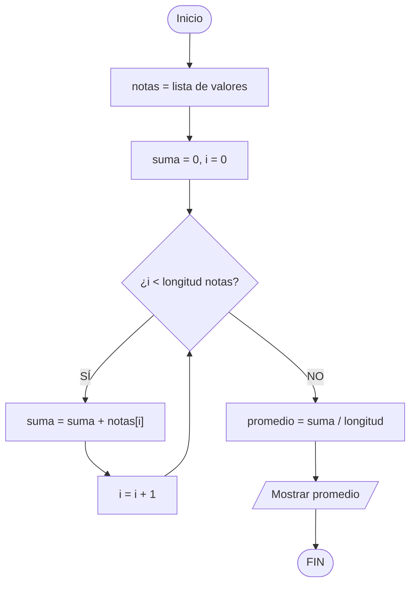
```mermaid
graph TD
    A([Inicio]) --> B["notas = lista de valores"]
    B --> C["suma = 0, i = 0"]
    C --> D{"¿i < longitud notas?"}
    D -- SÍ --> E["suma = suma + notas[i]"]
    E --> F["i = i + 1"]
    F --> D
    D -- NO --> G["promedio = suma / longitud"]
    G --> H[/"Mostrar promedio"/]
    H --> I([FIN])
```

---

#### 6.5 Métodos útiles de listas

```python
numeros = [3, 1, 4, 1, 5, 9, 2, 6]

print(max(numeros))       # 9 — el mayor
print(min(numeros))       # 1 — el menor
print(sum(numeros))       # 31 — la suma
numeros.sort()            # Ordena de menor a mayor
print(numeros)            # [1, 1, 2, 3, 4, 5, 6, 9]
numeros.reverse()         # Invierte el orden
print(numeros)            # [9, 6, 5, 4, 3, 2, 1, 1]
print(numeros.count(1))   # 2 — cuántas veces aparece el 1
print(1 in numeros)       # True — ¿está el 1 en la lista?
```

**Equivalente en C# (usando System.Linq):**
```csharp
using System.Linq;

List<int> numeros = new List<int> { 3, 1, 4, 1, 5, 9, 2, 6 };

Console.WriteLine(numeros.Max());    // 9
Console.WriteLine(numeros.Min());    // 1
Console.WriteLine(numeros.Sum());    // 31
numeros.Sort();                      // Ordena
numeros.Reverse();                   // Invierte
Console.WriteLine(numeros.Contains(1)); // True
```

---

### 🛠️ TALLER INDIVIDUAL — Clase 6
#### "El gestor de datos"

> ⏱️ **Tiempo:** 45 minutos  
> 📝 **Formato:** Código escrito a mano. Diferente dataset para cada estudiante.

**El problema:** Desarrolla un programa que gestione una lista de **N números** (donde N es tu número de lista + 5). El programa debe:

1. Pedir al usuario que ingrese los N números uno a uno y guardarlos en una lista.
2. Mostrar el mayor, el menor y el promedio.
3. Contar cuántos números son mayores que el promedio.
4. Mostrar la lista ordenada de mayor a menor.
5. Buscar si un número ingresado por el usuario está en la lista y en qué posición.

**Variante por apellido (inicial):**
- A–G: Los números deben ser positivos. Si el usuario ingresa uno negativo, debe pedirlo de nuevo.
- H–N: Además de lo anterior, calcular la mediana (valor del medio al ordenar).
- O–Z: Además, eliminar todos los duplicados antes de mostrar la lista ordenada.

> 📌 **Estrategia anti-copia:** N diferente por estudiante. Variante diferente por inicial de apellido. Entrega manuscrita verificable.

---

---

# 🟫 CLASE 7
## Arreglos — Parte II y Matrices

> **Duración:** 3 horas · Descanso a los 90 minutos

---

### 🎯 Objetivos de la clase
- Manejar listas de strings y listas paralelas.
- Entender qué es una matriz (lista de listas).
- Recorrer y operar matrices bidimensionales.

---

### ⏱️ Distribución del tiempo

| Bloque | Actividad | Tiempo |
|--------|-----------|--------|
| 1 | Repaso + listas de strings | 20 min |
| 2 | Listas paralelas | 25 min |
| 3 | Introducción a matrices | 30 min |
| — | ☕ **DESCANSO** | 15 min |
| 4 | Recorrer y operar matrices | 30 min |
| 5 | Ejemplos prácticos | 15 min |
| 6 | 🛠️ Taller individual | 45 min |

---

### 📖 Contenido

#### 7.1 Listas de strings

```python
nombres = ["Ana", "Luis", "María", "Jorge"]

# Buscar un nombre
buscado = input("¿A quién buscas? ")
if buscado in nombres:
    print(f"{buscado} está en la lista.")
else:
    print(f"{buscado} NO está en la lista.")

# Convertir a mayúsculas
for nombre in nombres:
    print(nombre.upper())
```

**Equivalente en C#:**
```csharp
List<string> nombres = new List<string> { "Ana", "Luis", "María", "Jorge" };

Console.Write("¿A quién buscas? ");
string buscado = Console.ReadLine();
if (nombres.Contains(buscado)) {
    Console.WriteLine($"{buscado} está en la lista.");
} else {
    Console.WriteLine($"{buscado} NO está en la lista.");
}

foreach (string nombre in nombres) {
    Console.WriteLine(nombre.ToUpper());
}
```

---

#### 7.2 Listas paralelas

Las **listas paralelas** son dos o más listas donde el elemento en la posición `i` de una lista corresponde al elemento `i` de la otra lista.

```python
alumnos  = ["Ana",  "Luis", "María", "Jorge"]
notas    = [ 4.5,    3.8,    4.0,     2.7  ]
aprobado = [ True,   True,   True,    False ]

for i in range(len(alumnos)):
    estado = "APROBÓ" if aprobado[i] else "REPROBÓ"
    print(f"{alumnos[i]:10} — Nota: {notas[i]} — {estado}")
```

**Equivalente en C#:**
```csharp
string[] alumnos = { "Ana", "Luis", "María", "Jorge" };
double[] notas = { 4.5, 3.8, 4.0, 2.7 };
bool[] aprobado = { true, true, true, false };

for (int i = 0; i < alumnos.Length; i++) {
    string estado = aprobado[i] ? "APROBÓ" : "REPROBÓ";
    Console.WriteLine($"{alumnos[i],-10} — Nota: {notas[i]} — {estado}");
}
```

---

#### 7.3 Matrices (listas de listas)

Una **matriz** es una lista cuyos elementos son a su vez listas. Se accede con dos índices: `matriz[fila][columna]`.

```
       Col 0  Col 1  Col 2
Fila 0: [ 1,    2,    3 ]
Fila 1: [ 4,    5,    6 ]
Fila 2: [ 7,    8,    9 ]
```

```python
# Crear una matriz 3×3
matriz = [
    [1, 2, 3],
    [4, 5, 6],
    [7, 8, 9]
]

# Acceder a elementos
print(matriz[0][0])  # 1 — fila 0, columna 0
print(matriz[1][2])  # 6 — fila 1, columna 2
print(matriz[2][1])  # 8 — fila 2, columna 1
```

**Equivalente en C#:**
```csharp
// Matriz bidimensional (Rectangular)
int[,] matriz = {
    {1, 2, 3},
    {4, 5, 6},
    {7, 8, 9}
};

Console.WriteLine(matriz[0, 0]); // 1
Console.WriteLine(matriz[1, 2]); // 6
Console.WriteLine(matriz[2, 1]); // 8
```

---

#### 7.4 Recorrer matrices

```python
matriz = [
    [1, 2, 3],
    [4, 5, 6],
    [7, 8, 9]
]

# Recorrer todas las celdas
for fila in matriz:
    for elemento in fila:
        print(elemento, end=" ")
    print()  # Salto de línea al terminar cada fila

# Con índices
filas = len(matriz)
columnas = len(matriz[0])
for i in range(filas):
    for j in range(columnas):
        print(f"[{i}][{j}]={matriz[i][j]}", end="  ")
    print()
```

**Equivalente en C#:**
```csharp
int[,] matriz = { {1,2,3}, {4,5,6}, {7,8,9} };

// Recorrer con bucles anidados
for (int i = 0; i < matriz.GetLength(0); i++) {
    for (int j = 0; j < matriz.GetLength(1); j++) {
        Console.Write(matriz[i, j] + " ");
    }
    Console.WriteLine();
}
```

---

#### 7.5 Operaciones con matrices

```python
# Suma de todos los elementos
total = 0
for fila in matriz:
    for elemento in fila:
        total += elemento
print("Suma total:", total)

# Diagonal principal (solo en matrices cuadradas)
print("Diagonal principal:")
for i in range(len(matriz)):
    print(matriz[i][i], end=" ")

# Crear una matriz dinámica (con input del usuario)
filas = int(input("Filas: "))
cols = int(input("Columnas: "))
tabla = []
for i in range(filas):
    fila = []
    for j in range(cols):
        valor = int(input(f"Elemento [{i}][{j}]: "))
        fila.append(valor)
    tabla.append(fila)
```

**Equivalente en C#:**
```csharp
// Suma total
int total = 0;
foreach (int elemento in matriz) total += elemento;

// Diagonal
for (int i = 0; i < matriz.GetLength(0); i++) {
    Console.Write(matriz[i, i] + " ");
}

// Matriz dinámica
Console.Write("Filas: ");
int f = int.Parse(Console.ReadLine());
Console.Write("Cols: ");
int c = int.Parse(Console.ReadLine());
int[,] tabla = new int[f, c];
for (int i = 0; i < f; i++) {
    for (int j = 0; j < c; j++) {
        Console.Write($"Elemento [{i}][{j}]: ");
        tabla[i, j] = int.Parse(Console.ReadLine());
    }
}
```

---

#### 7.6 Ejemplos prácticos

**Ejemplo — Tabla de calificaciones:**
```python
materias = ["Matemáticas", "Español", "Ciencias"]
alumnos  = ["Ana", "Luis", "María"]
notas    = [
    [4.5, 3.8, 4.2],   # Notas de Ana
    [3.0, 4.1, 3.7],   # Notas de Luis
    [4.8, 4.9, 5.0]    # Notas de María
]

print(f"{'Alumno':10}", end="")
for m in materias:
    print(f"{m:15}", end="")
print("Promedio")
print("-" * 60)

for i, alumno in enumerate(alumnos):
    print(f"{alumno:10}", end="")
    suma = 0
    for j in range(len(materias)):
        print(f"{notas[i][j]:<15}", end="")
        suma += notas[i][j]
    print(f"{suma/len(materias):.2f}")
```

**Ejemplo en C#:**
```csharp
string[] materias = { "Matemáticas", "Español", "Ciencias" };
string[] alumnos = { "Ana", "Luis", "María" };
double[,] notas = {
    {4.5, 3.8, 4.2},
    {3.0, 4.1, 3.7},
    {4.8, 4.9, 5.0}
};

Console.WriteLine($"{"Alumno",-10} {"Matemáticas",-15} {"Español",-15} {"Ciencias",-15} Promedio");
for (int i = 0; i < alumnos.Length; i++) {
    Console.Write($"{alumnos[i],-10} ");
    double suma = 0;
    for (int j = 0; j < materias.Length; j++) {
        Console.Write($"{notas[i, j],-15} ");
        suma += notas[i, j];
    }
    Console.WriteLine($"{(suma / materias.Length):F2}");
}
```

**Diagrama de flujo (Mermaid):**
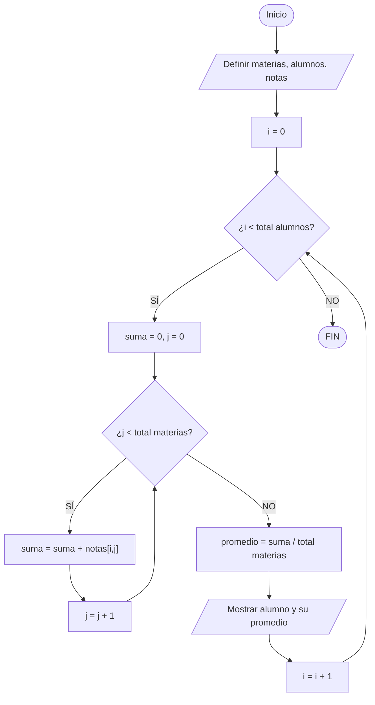
```mermaid
graph TD
    A([Inicio]) --> B[/"Definir materias, alumnos, notas"/]
    B --> C["i = 0"]
    C --> D{"¿i < total alumnos?"}
    D -- SÍ --> E["suma = 0, j = 0"]
    E --> F{"¿j < total materias?"}
    F -- SÍ --> G["suma = suma + notas[i,j]"]
    G --> H["j = j + 1"]
    H --> F
    F -- NO --> I["promedio = suma / total materias"]
    I --> J[/"Mostrar alumno y su promedio"/]
    J --> K["i = i + 1"]
    K --> D
    D -- NO --> L([FIN])
```

---

### 🛠️ TALLER INDIVIDUAL — Clase 7
#### "El tablero mágico"

> ⏱️ **Tiempo:** 45 minutos  
> 📝 **Formato:** Diagrama + código a mano.

Cada estudiante recibe una **dimensión N** (basada en su número de lista: si es par N=3, si es impar N=4).

**Parte 1:** Crea una matriz N×N rellena con los números del 1 al N² (fila por fila).

**Parte 2:** Calcula y muestra:
- La suma de cada fila.
- La suma de cada columna.
- La suma de la diagonal principal.
- El elemento mayor y su posición [fila][columna].

**Parte 3 (desafío):** Rota la matriz 90° en sentido horario. Muestra el resultado.

> 📌 **Estrategia anti-copia:** N diferente por paridad. La Parte 3 es desafío diferenciador. La rotación requiere razonamiento propio.

---

---

# ⬛ CLASE 8
## Integración: Algoritmos más Complejos

> **Duración:** 3 horas · Descanso a los 90 minutos

---

### 🎯 Objetivos de la clase
- Combinar estructuras de control, funciones y listas en un solo programa.
- Desarrollar pensamiento algorítmico para problemas de mayor complejidad.
- Implementar algoritmos clásicos: búsqueda y ordenamiento.

---

### ⏱️ Distribución del tiempo

| Bloque | Actividad | Tiempo |
|--------|-----------|--------|
| 1 | Repaso integrado | 20 min |
| 2 | Búsqueda lineal y binaria | 35 min |
| 3 | Ordenamiento burbuja | 25 min |
| — | ☕ **DESCANSO** | 15 min |
| 4 | Mini-proyecto guiado | 30 min |
| 5 | Reflexión y patrones algorítmicos | 10 min |
| 6 | 🛠️ Taller individual | 45 min |

---

### 📖 Contenido

#### 8.1 Búsqueda lineal

Recorre la lista elemento por elemento hasta encontrar el buscado.

```python
def busqueda_lineal(lista, objetivo):
    for i in range(len(lista)):
        if lista[i] == objetivo:
            return i  # Retorna la posición
    return -1  # No encontrado

numeros = [15, 3, 42, 8, 27, 64, 11]
pos = busqueda_lineal(numeros, 27)
if pos != -1:
    print(f"Encontrado en la posición {pos}")
else:
    print("No encontrado")
```

**Ejemplo en C#:**
```csharp
int BusquedaLineal(int[] lista, int objetivo) {
    for (int i = 0; i < lista.Length; i++) {
        if (lista[i] == objetivo) return i;
    }
    return -1;
}

int[] numeros = { 15, 3, 42, 8, 27, 64, 11 };
int pos = BusquedaLineal(numeros, 27);
if (pos != -1) Console.WriteLine($"Encontrado en la posición {pos}");
else Console.WriteLine("No encontrado");
```

**Diagrama de flujo (Mermaid):**
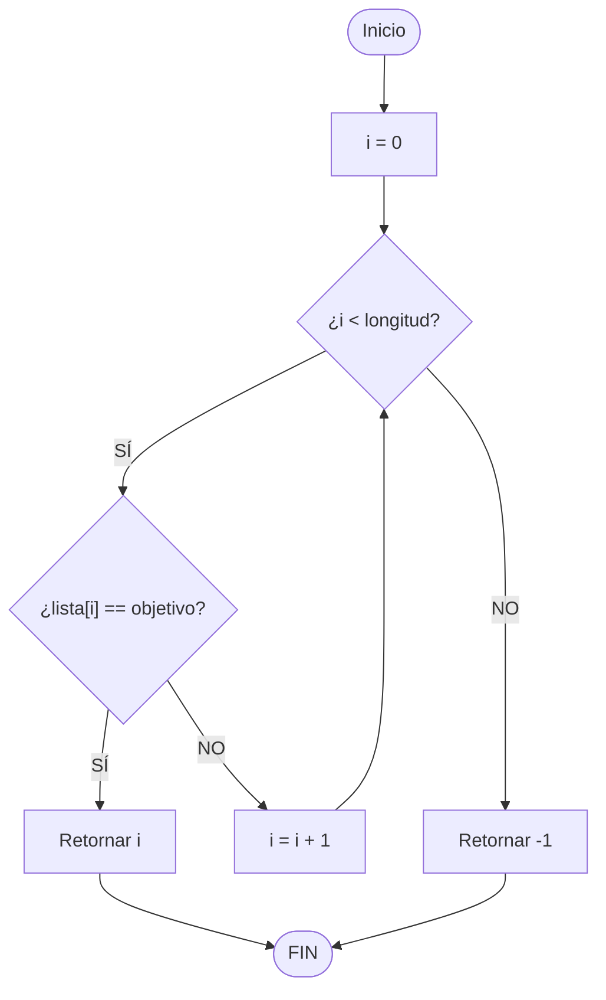
```mermaid
graph TD
    A([Inicio]) --> B["i = 0"]
    B --> C{"¿i < longitud?"}
    C -- SÍ --> D{"¿lista[i] == objetivo?"}
    D -- SÍ --> E["Retornar i"]
    D -- NO --> F["i = i + 1"]
    F --> C
    C -- NO --> G["Retornar -1"]
    E --> H([FIN])
    G --> H
```

---

#### 8.2 Búsqueda binaria

Solo funciona en listas **ordenadas**. Es mucho más rápida que la lineal.

```python
def busqueda_binaria(lista, objetivo):
    izquierda = 0
    derecha = len(lista) - 1
    while izquierda <= derecha:
        medio = (izquierda + derecha) // 2
        if lista[medio] == objetivo:
            return medio
        elif lista[medio] < objetivo:
            izquierda = medio + 1
        else:
            derecha = medio - 1
    return -1

ordenada = [2, 5, 8, 12, 16, 23, 38, 56, 72, 91]
print(busqueda_binaria(ordenada, 23))  # 5
print(busqueda_binaria(ordenada, 10))  # -1
```

**Ejemplo en C#:**
```csharp
int BusquedaBinaria(int[] lista, int objetivo) {
    int izquierda = 0, derecha = lista.Length - 1;
    while (izquierda <= derecha) {
        int medio = (izquierda + derecha) / 2;
        if (lista[medio] == objetivo) return medio;
        else if (lista[medio] < objetivo) izquierda = medio + 1;
        else derecha = medio - 1;
    }
    return -1;
}
```

**Diagrama de flujo (Mermaid):**
```mermaid
graph TD
    A([Inicio]) --> B["izq = 0, der = n-1"]
    B --> C{"¿izq <= der?"}
    C -- SÍ --> D["medio = (izq + der) / 2"]
    D --> E{"¿lista[medio] == obj?"}
    E -- SÍ --> F["Retornar medio"]
    E -- NO --> G{"¿lista[medio] < obj?"}
    G -- SÍ --> H["izq = medio + 1"]
    G -- NO --> I["der = medio - 1"]
    H --> C
    I --> C
    C -- NO --> J["Retornar -1"]
    F --> K([FIN])
    J --> K
```

> 💡 ¿Por qué es más eficiente? Con 1000 elementos, la búsqueda lineal hace hasta 1000 comparaciones. La binaria solo necesita ¡10!

---

#### 8.3 Ordenamiento burbuja (Bubble Sort)

Compara pares adyacentes y los intercambia si están en el orden incorrecto.

```python
def burbuja(lista):
    n = len(lista)
    for i in range(n - 1):
        for j in range(n - i - 1):
            if lista[j] > lista[j + 1]:
                # Intercambiar
                lista[j], lista[j + 1] = lista[j + 1], lista[j]
    return lista

numeros = [64, 34, 25, 12, 22, 11, 90]
print("Antes:", numeros)
print("Después:", burbuja(numeros))
```

**Ejemplo en C#:**
```csharp
void Burbuja(int[] lista) {
    int n = lista.Length;
    for (int i = 0; i < n - 1; i++) {
        for (int j = 0; j < n - i - 1; j++) {
            if (lista[j] > lista[j + 1]) {
                int temp = lista[j];
                lista[j] = lista[j + 1];
                lista[j + 1] = temp;
            }
        }
    }
}
```

**Diagrama de flujo (Mermaid):**
```mermaid
graph TD
    A([Inicio]) --> B["i = 0"]
    B --> C{"¿i < n-1?"}
    C -- SÍ --> D["j = 0"]
    D --> E{"¿j < n-i-1?"}
    E -- SÍ --> F{"¿lista[j] > lista[j+1]?"}
    F -- SÍ --> G[/"Intercambiar lista[j] y lista[j+1]"/]
    F -- NO --> H["j = j + 1"]
    G --> H
    H --> E
    E -- NO --> I["i = i + 1"]
    I --> C
    C -- NO --> J([FIN])
```

---

#### 8.4 Mini-proyecto guiado: Sistema de notas

```python
def ingresar_notas(n):
    notas = []
    for i in range(n):
        nota = float(input(f"Nota {i+1}: "))
        notas.append(nota)
    return notas

def calcular_estadisticas(notas):
    promedio = sum(notas) / len(notas)
    maxima = max(notas)
    minima = min(notas)
    aprobados = sum(1 for n in notas if n >= 3.0)
    return promedio, maxima, minima, aprobados

def mostrar_reporte(notas, nombres):
    promedio, maxima, minima, aprobados = calcular_estadisticas(notas)
    print("\n===== REPORTE DEL CURSO =====")
    for i, nombre in enumerate(nombres):
        estado = "✔" if notas[i] >= 3.0 else "✘"
        print(f"  {nombre:15} {notas[i]:.1f}  {estado}")
    print(f"\nPromedio del curso: {promedio:.2f}")
    print(f"Nota más alta: {maxima:.1f}")
    print(f"Nota más baja: {minima:.1f}")
    print(f"Aprobados: {aprobados}/{len(notas)}")

# Programa principal
n = int(input("¿Cuántos estudiantes? "))
nombres = [input(f"Nombre del estudiante {i+1}: ") for i in range(n)]
notas = ingresar_notas(n)
mostrar_reporte(notas, nombres)
```

**Ejemplo en C#:**
```csharp
using System;
using System.Collections.Generic;
using System.Linq;

class ProgramaNotas {
    static List<double> IngresarNotas(int n) {
        List<double> notas = new List<double>();
        for (int i = 0; i < n; i++) {
            Console.Write($"Nota {i + 1}: ");
            notas.Add(double.Parse(Console.ReadLine()));
        }
        return notas;
    }

    static (double, double, double, int) CalcularEstadisticas(List<double> notas) {
        double promedio = notas.Average();
        double maxima = notas.Max();
        double minima = notas.Min();
        int aprobados = notas.Count(n => n >= 3.0);
        return (promedio, maxima, minima, aprobados);
    }

    static void MostrarReporte(List<double> notas, List<string> nombres) {
        var (promedio, maxima, minima, aprobados) = CalcularEstadisticas(notas);
        Console.WriteLine("\n===== REPORTE DEL CURSO =====");
        for (int i = 0; i < nombres.Count; i++) {
            string estado = notas[i] >= 3.0 ? "✔" : "✘";
            Console.WriteLine($"{nombres[i],-15} {notas[i]:F1} {estado}");
        }
        Console.WriteLine($"\nPromedio del curso: {promedio:F2}");
        Console.WriteLine($"Nota más alta: {maxima:F1}");
        Console.WriteLine($"Nota más baja: {minima:F1}");
        Console.WriteLine($"Aprobados: {aprobados}/{notas.Count}");
    }

    static void Main() {
        Console.Write("¿Cuántos estudiantes? ");
        int n = int.Parse(Console.ReadLine());
        List<string> nombres = new List<string>();
        for (int i = 0; i < n; i++) {
            Console.Write($"Nombre del estudiante {i+1}: ");
            nombres.Add(Console.ReadLine());
        }
        List<double> notas = IngresarNotas(n);
        MostrarReporte(notas, nombres);
    }
}
```

---

### 🛠️ TALLER INDIVIDUAL — Clase 8
#### "Sistema de gestión personalizado"

> ⏱️ **Tiempo:** 45 minutos  
> 📝 **Formato:** Pseudocódigo + código Python a mano

Cada estudiante diseña e implementa un sistema de gestión usando **todo lo aprendido**. El tema es asignado por el profesor según número de lista:

**Par:** Sistema de inventario de una tienda de videojuegos. Almacena nombre, precio y cantidad de 5 juegos. Permite buscar un juego por nombre, ordenar por precio y calcular el valor total del inventario.

**Impar:** Sistema de registro de jugadores de un torneo. Almacena nombre, puntaje y nivel (1-3) de 5 jugadores. Permite encontrar al campeón, ordenar por puntaje y mostrar estadísticas por nivel.

**Requisitos mínimos:**
- Al menos 3 funciones definidas por el estudiante.
- Uso de listas (puede incluir listas paralelas o matrices).
- Al menos un ciclo y una estructura de decisión.
- Comentarios explicando cada sección del código.

> 📌 **Estrategia anti-copia:** Tema diferente por paridad. La originalidad del sistema y el estilo de los comentarios evidencian el trabajo propio. El estudiante debe defender oralmente una función de su código al entregarlo.

---

---

# 🏆 CLASE 9
## Proyecto Final + Cierre del Curso

> **Duración:** 3 horas · Descanso a los 90 minutos

---

### 🎯 Objetivos de la clase
- Demostrar el dominio de todas las competencias del curso.
- Desarrollar un proyecto integrador original.
- Reflexionar sobre el aprendizaje y las competencias adquiridas.

---

### ⏱️ Distribución del tiempo

| Bloque | Actividad | Tiempo |
|--------|-----------|--------|
| 1 | Presentación del proyecto final | 15 min |
| 2 | Desarrollo del proyecto | 60 min |
| — | ☕ **DESCANSO** | 15 min |
| 3 | Continuación del proyecto | 45 min |
| 4 | Presentaciones rápidas (2 min c/u) | 25 min |
| 5 | Retroalimentación y cierre | 20 min |

---

### 📖 Descripción del Proyecto Final

#### 🎮 "MINI-APLICACIÓN"

El estudiante debe desarrollar una **mini-aplicación funcional** en Python que resuelva un problema real usando **todos los elementos del curso**.

---

#### Requisitos mínimos del proyecto

| Elemento | Requisito |
|----------|-----------|
| Variables y tipos | Al menos 3 tipos de datos diferentes |
| Decisiones | Al menos 2 estructuras if/elif/else |
| Ciclos | Al menos un `while` Y un `for` |
| Funciones | Al menos 4 funciones propias |
| Listas | Al menos una lista con mínimo 5 elementos |
| Entrada/Salida | Interacción con el usuario (input/print) |
| Comentarios | Cada función debe tener un comentario explicativo |

---

#### Temas sugeridos (el estudiante puede proponer otro)

> El tema debe ser aprobado por el profesor al inicio de la sesión.

- 🎮 **Juego de preguntas:** Un quiz con 10 preguntas de una categoría elegida por el estudiante. Puntaje, niveles y estadísticas.
- 🏥 **Calculadora de salud:** IMC, calorías, hidratación, sueño recomendado. Muestra un reporte personalizado.
- 🛒 **Caja registradora:** Gestión de productos, cálculo de facturas, descuentos y vueltos.
- 📊 **Analizador de notas:** Ingresa notas de varias materias, calcula estadísticas, genera un boletín.
- 🌦️ **Registro climático:** Ingresa temperaturas de una semana, calcula promedios, identifica días más calurosos y más fríos.
- 🗓️ **Organizador de tareas:** Lista de tareas con prioridad, marcar completadas, mostrar pendientes.

---

#### Rúbrica de evaluación

| Criterio | Puntaje máximo |
|----------|---------------|
| Cumple todos los requisitos mínimos | 30 pts |
| El programa funciona correctamente sin errores | 25 pts |
| El código está bien organizado y comentado | 20 pts |
| La presentación es clara y el estudiante puede explicarlo | 15 pts |
| Creatividad e innovación en la solución | 10 pts |
| **TOTAL** | **100 pts** |

---

#### 🛡️ Estrategias anti-copia para el proyecto final

1. **Tema único registrado:** Cada estudiante registra su tema al inicio. No puede haber dos proyectos iguales.
2. **Presentación oral obligatoria:** 2 minutos donde el estudiante explica una función específica elegida al azar por el profesor.
3. **Variable identificadora:** Cada proyecto debe incluir una variable `AUTOR = "NombreApellido"` y el programa debe mostrarla al iniciar.
4. **Bitácora de desarrollo:** Durante el desarrollo, el estudiante escribe en una hoja (una frase cada 15 minutos) qué está haciendo. Esta hoja se entrega junto con el código.
5. **Preguntas de comprensión:** Al presentar, el profesor hace al menos 2 preguntas de tipo "¿Qué pasaría si cambias este valor?" o "¿Por qué usaste un `while` aquí?".

---

### 🎓 Cierre del Curso

#### Reflexión final

Responde en tu cuaderno:

1. ¿Qué fue lo más difícil del curso? ¿Cómo lo superaste?
2. ¿En qué situaciones de tu vida cotidiana puedes aplicar el pensamiento algorítmico?
3. ¿Qué concepto te pareció más útil? ¿Por qué?
4. Si tuvieras que enseñarle a alguien el concepto más importante del curso, ¿cuál elegirías y cómo lo explicarías?

---

#### Lo que aprendiste a hacer

Al terminar este curso eres capaz de:

✅ Descomponer un problema en pasos lógicos y precisos.  
✅ Representar algoritmos con diagramas de flujo y pseudocódigo.  
✅ Usar variables, tipos de datos y operadores para manipular información.  
✅ Tomar decisiones en un programa usando estructuras condicionales.  
✅ Repetir acciones eficientemente con ciclos `while` y `for`.  
✅ Organizar tu código en funciones reutilizables.  
✅ Almacenar y manipular colecciones de datos con listas y matrices.  
✅ Combinar todas estas herramientas para resolver problemas reales.  

---

---

# 📎 APÉNDICE A — Referencia rápida de Python

## Estructura básica de un programa

```python
# 1. Comentarios (el # hace que la línea sea ignorada por Python)
# 2. Variables
nombre = "Mundo"

# 3. Entrada
dato = input("Ingresa algo: ")

# 4. Salida
print("Hola,", nombre)
print(f"El dato es: {dato}")

# 5. Conversiones de tipo
entero = int("42")
decimal = float("3.14")
texto = str(100)
```

**Equivalente en C#:**
```csharp
// 1. Comentarios
// 2. Variables
string nombre = "Mundo";

// 3. Entrada
string dato = Console.ReadLine();

// 4. Salida
Console.WriteLine("Hola, " + nombre);
Console.WriteLine($"El dato es: {dato}");

// 5. Conversiones
int entero = int.Parse("42");
double decimal = double.Parse("3.14");
string texto = 100.ToString();
```

## Tabla de referencia de estructuras

```python
# IF / ELIF / ELSE
if condicion1:
    pass
elif condicion2:
    pass
else:
    pass

# WHILE
while condicion:
    pass

# FOR
for i in range(inicio, fin, paso):
    pass

for elemento in lista:
    pass

# FUNCIÓN
def nombre(param1, param2):
    # cuerpo
    return resultado

# LISTA
lista = [1, 2, 3]
lista.append(4)
lista[0]        # primer elemento
lista[-1]       # último elemento
len(lista)      # cantidad de elementos

# MATRIZ
matriz = [[1,2],[3,4]]
matriz[0][1]    # fila 0, columna 1
```

**Equivalente en C#:**
```csharp
// IF / ELSE IF / ELSE
if (condicion1) { }
else if (condicion2) { }
else { }

// WHILE
while (condicion) { }

// FOR
for (int i = inicio; i < fin; i += paso) { }

foreach (var elemento in lista) { }

// FUNCIÓN
T_Retorno Nombre(T1 p1, T2 p2) {
    return resultado;
}

// LISTA
List<int> lista = new List<int> { 1, 2, 3 };
lista.Add(4);
int x = lista[0];
int y = lista[lista.Count - 1]; // último

// MATRIZ
int[,] matriz = { {1, 2}, {3, 4} };
int z = matriz[0, 1];
```

---

# 📎 APÉNDICE B — Tabla de errores comunes

| Error | Causa | Solución |
|-------|-------|----------|
| `SyntaxError` | Error de escritura en el código | Revisa la línea señalada |
| `IndentationError` | Indentación incorrecta | Usa siempre 4 espacios |
| `NameError` | Variable usada antes de definirla | Define la variable primero |
| `TypeError` | Operación entre tipos incompatibles | Convierte los tipos con `int()`, `str()`, etc. |
| `IndexError` | Índice fuera del rango de la lista | Verifica que el índice sea menor que `len(lista)` |
| `ZeroDivisionError` | División entre cero | Verifica que el divisor no sea 0 antes de dividir |
| `ValueError` | Valor no convertible | Asegúrate de que el texto sea un número antes de convertir |

---

# 📎 APÉNDICE C — Glosario

| Término | Definición |
|---------|-----------|
| **Algoritmo** | Conjunto de pasos finitos y precisos para resolver un problema |
| **Variable** | Espacio en memoria con nombre que guarda un valor |
| **Condición** | Expresión que resulta en `True` o `False` |
| **Ciclo** | Estructura que repite instrucciones |
| **Función** | Bloque de código con nombre que puede reutilizarse |
| **Parámetro** | Variable que recibe una función al ser llamada |
| **Retorno** | Valor que devuelve una función con `return` |
| **Lista** | Colección ordenada de elementos |
| **Índice** | Número que identifica la posición de un elemento en una lista |
| **Matriz** | Lista de listas (estructura bidimensional) |
| **Pseudocódigo** | Descripción de un algoritmo en lenguaje informal |
| **Diagrama de flujo** | Representación gráfica de un algoritmo |
| **Indentación** | Sangría usada en Python para definir bloques de código |
| **Módulo** | Archivo con funciones reutilizables |
| **Debug** | Proceso de encontrar y corregir errores en el código |

---

*Material elaborado para el curso de Herramientas Algorítmicas — 9 clases × 3 horas*  
*Nivel: Jóvenes de 15 años | Lenguaje: Python*
